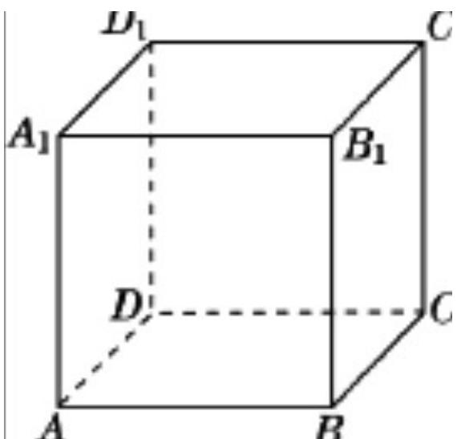

> [!faq]- 《第六章 计数原理（高效培优单元自测·强化卷）》官方解析
>
> > [!success]- **【答案】** 了便于数理分析，我们将他们依次对应数字 $^{0}$ 、 $^{1}$ 、 $^{2}$ 、 $^{3}$ 、 $^{4}$ 、 $^{5}$ ，形成一个六进制系统·六进制转换为十进 制数的方法是将每一位上的数字乘以 $^{6}$ 的相应次方（从 $^{0}$ 开始），然后将所有乘积相加例如，六进制数 013 转换为十进制数为 $0 \times 6^{2} + 1 \times 6^{1} + 3 \times 6^{0} = 9$ ；六进制数 0033 转换为十进制数为 $0 \times 6^{3} + 0 \times 6^{2} + 3 \times 6^{1} + 3 \times 6^{0} = 21$ 现将所有由 0、1、2、3、4、5 组成的 4 位无重复数字（如 1235，3201）的 六进制数转化为十进制数，在这些非零十进制数中任取一个，则这个数能被 $^{5}$ 整除的概率为\_\_\_\_。
>
> > [!note]- **【分析】**
> > 设 $a, b, c, d \in \{0, 1, 2, 3, 4, 5\}$ ，将六进制数 $abcd$ 转换为十进制形式，由该数能被整除转化为$a + b + c + d$ 能被5整除，根据该六进制数数字的所有可能组合，分类计算符合要求的数的个数，利用古典
> >
> > 概型概率公式计算即可·
>
> > [!note]- **【解析】**
> > 设 $a, b, c, d \in \{0, 1, 2, 3, 4, 5\}$ ，则 $^{4}$ 位六进制数 $abcd$ 转换为十进制为：
> >
> > $$
> > a \times 6 ^ {3} + b \times 6 ^ {2} + c \times 6 + d = a \times (1 + 5) ^ {3} + b \times (1 + 5) ^ {2} + c \times (1 + 5) + d
> > $$
> >
> > $$
> > = a \left(\mathrm{C} _ {3} ^ {0} + \mathrm{C} _ {3} ^ {1} \cdot 5 + \mathrm{C} _ {3} ^ {2} \cdot 5 ^ {2} + \mathrm{C} _ {3} ^ {3} \cdot 5 ^ {3}\right) + b \left(\mathrm{C} _ {2} ^ {0} + \mathrm{C} _ {2} ^ {1} \cdot 5 + \mathrm{C} _ {2} ^ {2} \cdot 5 ^ {2}\right) + 5 c + c + d
> > $$
> >
> > $$
> > = a \left(\mathrm{C} _ {3} ^ {1} \cdot 5 + \mathrm{C} _ {3} ^ {2} \cdot 5 ^ {2} + \mathrm{C} _ {3} ^ {3} \cdot 5 ^ {3}\right) + b \left(\mathrm{C} _ {2} ^ {1} \cdot 5 + \mathrm{C} _ {2} ^ {2} \cdot 5 ^ {2}\right) + 5 c + a + b + c + d
> > $$
> >
> > 若这个数能被 $^{5}$ 整除，则 $a+b+c+d$ 能被 $^{5}$ 整除.
> >
> > 当这个六进制数由 0,2,3,5 组成时，有 $3A_{3}^{3}=18$ 个；
> >
> > 当这个六进制数由 0,1,4,5 组成时，有 $3A_{3}^{3}=18$ 个；
> >
> > 当这个六进制数由 $1,2,3,4$ 组成时，有 $\mathrm{A}_4^4 = 24$ 个；
> >
> > 因为由 0,1,2,3,4,5 组成的 4 位非零六进制数共有 $5 \times A_{5}^{3} = 300$ 个，
> >
> > 所以能被 $^{5}$ 整除的概率
> >
> > $$
> > P = \frac {1 8 + 1 8 + 2 4}{3 0 0} = \frac {6 0}{3 0 0} = \frac {1}{5}.
> > $$
> >
> > 故答案为： $\frac{1}{5}$
> >
> > 14. 给正方体 $ABCD - A_{1}B_{1}C_{1}D_{1}$ 的 8 个顶点涂色，规则：从顶点 $A$ 开始涂色，之后每选取一个未涂色顶点且
> >
> > 与上次所涂顶点不在同一条棱上的顶点进行涂色．若涂色 $^{3}$ 次，则第 $^{3}$ 次恰好涂在 $A_{1}$ 点的概率为\_\_\_\_．
> >
> > 【答案】 $\frac{1}{6}$
> >
> > 【分析】按照分步乘法计数原理即可得到结果
> >
> > 【详解】
> >
> > 
> >
> > 正方体 $ABCD-A_{1}B_{1}C_{1}D_{1}$ 中，从顶点 A 开始涂色，第一次涂色后，与 A 不在同一条棱上的顶点有 $C, C_{1}, B_{1}, D_{1}$
> >
> > 共4种选择；
> >
> > 第二次涂色时，需选择一个与第一次所涂顶点不在同一条棱上的顶点。
> >
> > 假设第二次涂 C，则第三次可选 $A_{1}, B_{1}, D_{1}$ ，共 3 种；
> >
> > 假设第二次涂 $C_{1}$ ，则第三次可选 $A_{1}, B, D$ ，共3种；
> >
> > 假设第二次涂 $B_{1}$ ，则第三次可选 $D_{1}, C, D$ ，共3种；
> >
> > 假设第二次涂 $D_{1}$ ，则第三次可选 $B_{1}, B, C$ ，共3种；
> >
> > 所以总的路径为 $12$ 种，其中第 $3$ 次恰好涂在 $A_{1}$ 点的有 $2$ 种，所以概率为 $\frac{2}{12} = \frac{1}{6}$ .
> >
> > 故答案为： $\frac{1}{6}$
> >
> > 四、解答题：本题共5小题，共77分。解答应写出文字说明、证明过程或演算步骤。
