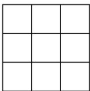

> [!faq]- 《第六章 计数原理（高效培优单元自测·提升卷）》官方解析
>
> > [!success]- **【答案】** 26 325
>
> > [!note]- **【分析】**
> > 对于第一空，将 $26^{25}$ 表示为 $26 \times (1 + 675)^{12}$ ，然后利用二项式知识可得答案；对于第二空，由第一
> >
> > 空结合二项式定理与杨辉三角关系可得答案·
>
> > [!note]- **【解析】**
> > 对于第一空，
> >
> > 因为 $26^{25}=26\times26^{24}=26\times676^{12}=26\times(1+675)^{12}$
> >
> > $$
> > = 2 6 \left(\mathrm{C} _ {1 2} ^ {0} + \mathrm{C} _ {1 2} ^ {1} 6 7 5 + \mathrm{C} _ {1 2} ^ {2} 6 7 5 ^ {2} + \dots + \mathrm{C} _ {1 2} ^ {1 2} 6 7 5 ^ {1 2}\right)
> > $$
> >
> > $$
> > = 2 6 + \left(\mathrm{C} _ {1 2} ^ {1} 6 7 5 + \mathrm{C} _ {1 2} ^ {2} 6 7 5 ^ {2} + \dots + \mathrm{C} _ {1 2} ^ {1 2} 6 7 5 ^ {1 2}\right)
> > $$
> >
> > 所以 $26^{25}$ 被 675 除所得的余数为 26；
> >
> > 对于第二空，由图可得第 $m$ 行，第 $n$ 个数为 $\left(a + b\right)^m$ 展开式的第 $n$ 项二项式系数
> >
> > 则 $a_{m,25} = a_{26,25} = \mathrm{C}_{26}^{24} = \mathrm{C}_{26}^{2} = 325$
> >
> > 故答案为：26；325.
> >
> > 14．九宫格是一个源自中国古代的概念，具有多种含义和应用，在数学领域：九宫格是一种数字游戏，起
> >
> > 源于河图洛书，要求在九个小格子中填入不同的数字，使得每一行每一列和对角线上的数字之和都相等·将
> >
> > 1\~9 的自然数填入九个格中，如图 1 的九宫格，“?”处应填的数字是\_\_\_\_；如图 2，不同的九宫格共有\_\_\_\_
> >
> > 种·
> >
> > <table><tr><td></td><td>9</td><td></td></tr><tr><td>3</td><td></td><td></td></tr><tr><td></td><td></td><td>?</td></tr></table>
> >
> > 图1
> >
> > 
> > 图2
> >
> > 【答案】 6 8
> >
> > 【分析】利用九宫格性质列式求解；确定九宫格中心位置的数字，再确定数字 $^{9}$ 所在位置，利用分步乘法
> >
> > 计数原理求解即得·
> >
> > 【详解】设九宫格的三行（从上到下）的数字从左到右分别为 $x_{1}, x_{2}, x_{3}$ ； $x_{4}, x_{5}, x_{6}$ ； $x_{7}, x_{8}, x_{9}$
> >
> > $$
> > x _ {1} + x _ {2} + x _ {3} = x _ {4} + x _ {5} + x _ {6} = x _ {7} + x _ {8} + x _ {9} = 1 5
> > $$
> >
> > $$
> > \left\{ \begin{array}{l} x _ {4} + x _ {5} + x _ {6} = 1 5 \\ x _ {2} + x _ {5} + x _ {8} = 1 5 \\ x _ {1} + x _ {5} + x _ {9} = 1 5, \text {得} \\ x _ {3} + x _ {5} + x _ {7} = 1 5 \end{array} \right.
> > $$
> >
> > 由 $x_{2} = 9, x_{4} = 3$ ，得 $x_{8} = 1, x_{6} = 7$ ， $\left\{ \begin{array}{l} x_{1} + x_{3} = 6 \\ x_{1} + x_{7} = 12 \\ x_{3} + x_{7} = 10 \end{array} \right.$ ，解得 $x_{1} = 4, x_{3} = 2, x_{7} = 8$ ， $x_{9} = 6$ ，
> >
> > 所以“?”处应填的数字是 $^{6}$ ;
> >
> > 数字 $^{5}$ 在九宫格的正中，数字 $^{9}$ 不能在九宫格的四个角上，否则：如 $x_{1}=9$ ，由 $x_{3}+x_{7}=10$
> >
> > 知 $x_{1} + x_{3}$ 或 $x_{1} + x_{7}$ 中有一个数大于 $^{15}$ ，矛盾，因此数字 $^{9}$ 只能在与 $^{5}$ 同行或同列的 $^{4}$ 个位置之一，
> >
> > 此时 $^{1}$ 位置确定，而 $2+9+4=15$ ，角上的数字 $^{2,4}$ 可互换位置，其它数字只有一种填法，
> >
> > 所以不同九宫格共有 $4 \times 2 = 8$ 种.
> >
> > 故答案为：6；8
> >
> > 四、解答题：本题共5小题，共77分。解答应写出文字说明、证明过程或演算步骤。
