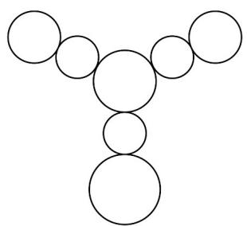

<!-- question-source:start -->
【变式2】如图所示的挂件由 $^{7}$ 个圆组成，中心圆为主挂件，从中心向三个方向延伸出分挂件，每个方向有

两个分挂件，靠近主挂件的为第一层分挂件，远离主挂件的为第二层分挂件．现用四种不同的颜色给所有的

挂件涂色，要求相邻的挂件涂不同的颜色，且同一层的分挂件涂不同的颜色，则所有的涂色方法种数为（）

A.54 B.154 C.264 D.286
<!-- question-source:end -->

![[高中/课堂同步/题库/人教A版高中数学同步讲义(2026)/05_选择性必修第三册/第六章 计数原理/讲义/专题6_1_分类加法计数原理与分步乘法计数原理_高效培优讲义_/题型03_两个原理的对比应用/questions/answers/Q00056297A1.md]]
