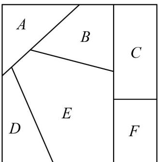

> [!faq]- 《专题6_1_分类加法计数原理与分步乘法计数原理_高效培优讲义_》官方解析
>
> > [!success]- **【答案】** B
>
> > [!note]- **【分析】**
> > 先利用计数原理得出所有的两位数，再减去重复数字即可·
>
> > [!note]- **【解析】**
> > 个位数取自集合 $A$ ，十位数取自集合 $B$ ，共有 $2 \times 3 = 6$ 个，个位数取自集合 $B$ ，十位数取自集合 $A$ ，共有 $3 \times 2 = 6$ 个，这两类中重复的有数字22，故所有样本点的个数为 $6 + 6 - 1 = 11$ .
> >
> > 故选：B
> >
> > 题型04 涂色问题
> >
> > 【典例1】给如图所示的六块区域 $A$ ， $B$ ， $C$ ， $D$ ， $E$ ， $F$ 涂色，有四种不同的颜色可供选择（不一定每种
> >
> > 颜色都要使用），要求相邻区域涂不同颜色，则不同的涂色方法种数是（）
> >
> > 
> >
> > A. 192 B. 168 C. 224 D. 208
> >
> > 【答案】A
> >
> > 【分析】利用分步乘法计数：先给 B，C，E 三块区域涂色，再给 F 区域涂色，然后给 A 区域涂色，最后给
> >
> > $D$ 区域涂色，即可求解·
> >
> > 【详解】第一步，给 B，C，E 三块区域涂色，有 $A_{4}^{3}$ 种涂色方法；
> >
> > 第二步，给 F 区域涂色，有 2 种涂色方法；
> >
> > 第三步，给 A 区域涂色，有 2 种涂色方法；
> >
> > 第四步，给 D 区域涂色，有 2 种涂色方法，
> >
> > 综上，不同的涂色方法种数是 $A_{4}^{3}\times2\times2\times2=192$ ，故A正确·
> >
> > 故选：A.
> >
> > ## 方法技巧
> >
> > 涂色问题分步(乘法)、分类(加法)处理：尽可能多的找两两相邻的区域，因为这些区域颜色各不相同，按乘法
> >
> > 原理涂色，再按分类涂剩余区域，一般分用剩余颜色与不用剩余颜色。
