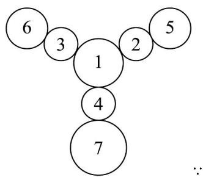

> [!faq]- 《专题6_1_分类加法计数原理与分步乘法计数原理_高效培优讲义_》官方解析
>
> > [!success]- **【答案】** C
>
> > [!note]- **【分析】**
> > 先对图中挂件进行编号，根据已知条件分析讨论各层挂件的涂色方法数，从而得出所有的涂色方法种数．
>
> > [!note]- **【解析】**
> > 给挂件进行如图所示的编号，
> >
> > 
> >
> > 中心圆为主挂件，从中心向三个方向延伸出分挂件，靠近主挂件的为第一层分挂件，
> >
> > 远离主挂件的为第二层分挂件，
> >
> > 用四种不同的颜色给所有的挂件涂色，要求相邻的挂件涂不同的颜色，且同一层的分挂件涂不同的颜色，
> >
> > ∴ 1 号有 $^{4}$ 种涂色方法，2，3，4 号有 $A_{3}^{3}=6$ 种涂色方法，
> >
> > 分情况讨论 $^{5}$ ， $^{6}$ ， $^{7}$ 号的涂色方法：
> > - **①**：若 $^{5}$ 号与 $^{1}$ 号同色， $^{6}$ 号与 $^{2}$ 号同色，则 $^{7}$ 号只有 $^{1}$ 种涂色方法，
> >
> > $\therefore 5,6,7$ 号有 $1\times1\times1=1$ 种涂色方法；
> > - **②**：若 $^{5}$ 号与 $^{1}$ 号同色， $^{6}$ 号与 $^{2}$ 号异色，此时 $^{6}$ 号只有 $^{1}$ 种涂色方法，则 $^{7}$ 号有 $^{2}$ 种涂色方法，
> >
> > $\therefore 5,6,7$ 号有 $1\times1\times2=2$ 种涂色方法；
> > - **③**：若 $^{5}$ 号与 $^{1}$ 号异色，与 $^{3}$ 号同色， $^{5}$ 号只有 $^{1}$ 种涂色方法，
> >
> > 当 $^{6}$ 号与 $^{4}$ 号同色时， $^{7}$ 号有 $^{2}$ 种涂色方法；
> >
> > 当 $^{6}$ 号与 $^{4}$ 号异色时， $^{6}$ 号有 $^{2}$ 种涂色方法， $^{7}$ 号有 $^{1}$ 种涂色方法，
> >
> > ∴ 5, 6, 7 号有 $1 \times (1 \times 2 + 2 \times 1) = 4$ 种涂色方法；
> > - **④**：若 $^{5}$ 号与 $^{1}$ 号、 $^{3}$ 号均异色，则 $^{5}$ 号只有 $^{1}$ 种涂色方法， $^{6}$ 号、 $^{7}$ 号均有 $^{2}$ 种涂色方法，
> >
> > $\therefore 5,6,7$ 号有 $1\times2\times2=4$ 种涂色方法；
> >
> > 综上，所有的涂色方法种数为 $= 4\mathrm{A}_3^3 (1 + 2 + 4 + 4) = 4\times 6\times 11 = 264$ ，故C正确.
> >
> > 故选 **C**.
