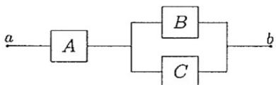

## 题型03 两个原理的对比应用

【典例1】如图，某设备内部从 $a$ 到 $b$ 的电路包含三个元件 $A, B, C$ ，现该设备从 $a$ 到 $b$ 的电路工作不正常

（断路），那么该设备三个元件 $A, B, C$ 的工作状态（通路/断路）共有 $n$ 种不同情况，则 $n$ 为（）

A 4 B 5 C 6 D 7

【答案】B

【分析】根据给定条件，利用分类加法计数原理、分步乘法计数原理列式求解·

【详解】元件 A 不通，设备从 a 到 b 的电路工作不正常，共有 $2 \times 2$ 种，

元件 A 正常，当且仅当元件 B, C 都不通，设备从 a 到 b 的电路工作不正常，只有 $^{1}$ 种，

所以 $n=1+4=5$ .

故选：B

## 方法技巧

在用两个原理解决问题时，一定要分清完成这件事，是有，1类办法还是需分成n个步骤。应用分类加法计

数原理必须要求各类中的每一种方法都保证完成这件事．应用分步乘法计数原理则是需各步均是完成这件事

必须经由的若干彼此独立的步骤.

![[高中/课堂同步/题库/人教A版高中数学同步讲义(2026)/05_选择性必修第三册/第六章 计数原理/讲义/专题6_1_分类加法计数原理与分步乘法计数原理_高效培优讲义_/题型03_两个原理的对比应用/questions/Q00056293.md]]
![[高中/课堂同步/题库/人教A版高中数学同步讲义(2026)/05_选择性必修第三册/第六章 计数原理/讲义/专题6_1_分类加法计数原理与分步乘法计数原理_高效培优讲义_/题型03_两个原理的对比应用/questions/Q00056294.md]]
![[高中/课堂同步/题库/人教A版高中数学同步讲义(2026)/05_选择性必修第三册/第六章 计数原理/讲义/专题6_1_分类加法计数原理与分步乘法计数原理_高效培优讲义_/题型03_两个原理的对比应用/questions/Q00056295.md]]
![[高中/课堂同步/题库/人教A版高中数学同步讲义(2026)/05_选择性必修第三册/第六章 计数原理/讲义/专题6_1_分类加法计数原理与分步乘法计数原理_高效培优讲义_/题型03_两个原理的对比应用/questions/Q00056296.md]]
![[高中/课堂同步/题库/人教A版高中数学同步讲义(2026)/05_选择性必修第三册/第六章 计数原理/讲义/专题6_1_分类加法计数原理与分步乘法计数原理_高效培优讲义_/题型03_两个原理的对比应用/questions/Q00056297.md]]
![[高中/课堂同步/题库/人教A版高中数学同步讲义(2026)/05_选择性必修第三册/第六章 计数原理/讲义/专题6_1_分类加法计数原理与分步乘法计数原理_高效培优讲义_/题型03_两个原理的对比应用/questions/Q00056298.md]]
