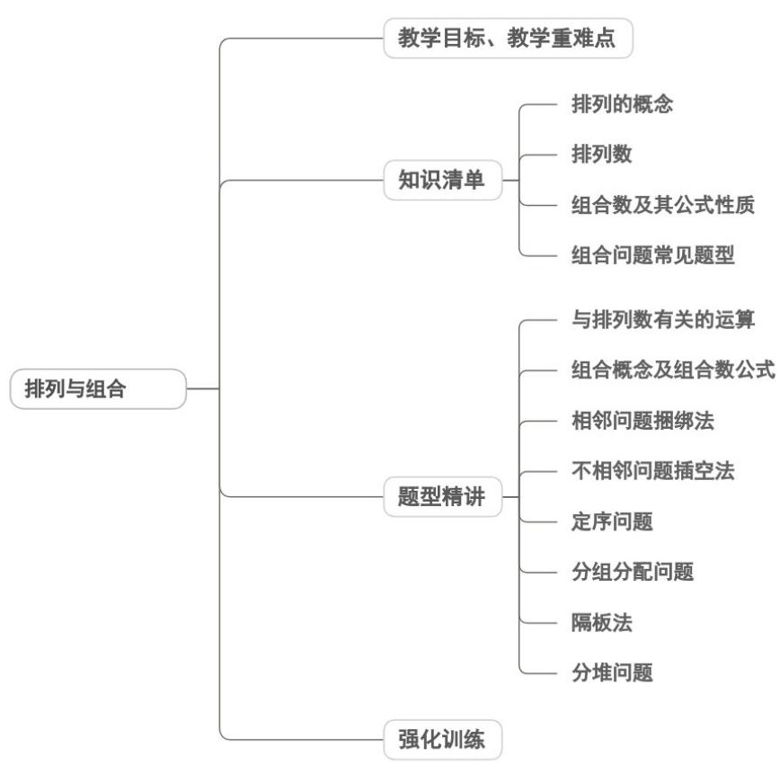

<!-- source-part:1 pages:1-50 -->

## 专题6.2 排列与组合

## 内容概览

## 教学目标、教学重难点

<table><tr><td>教学目标</td><td>1.理解排列、组合的核心定义,明确两者的本质区别(有序/无序)。2.掌握排列数 $A_n^m$ 、组合数 $C_n^m$ 的计算公式及推导,能熟练计算简单的排列、组合问题。3.能根据实际问题的特征,准确判断是排列问题还是组合问题,并选择对应方法求解。</td></tr><tr><td>教学重难点</td><td>重点1.排列、组合的定义辨析,能准确区分有序的排列问题和无序的组合问题。</td></tr></table>

![[高中/课堂同步/题库/人教A版高中数学同步讲义(2026)/05_选择性必修第三册/第六章 计数原理/讲义/专题6_2_排列与组合_高效培优讲义_/知识清单_sec_01/知识清单_sec_01.md]]
![[高中/课堂同步/题库/人教A版高中数学同步讲义(2026)/05_选择性必修第三册/第六章 计数原理/讲义/专题6_2_排列与组合_高效培优讲义_/知识点_01_排列的概念_sec_02/知识点_01_排列的概念_sec_02.md]]
![[高中/课堂同步/题库/人教A版高中数学同步讲义(2026)/05_选择性必修第三册/第六章 计数原理/讲义/专题6_2_排列与组合_高效培优讲义_/即学即练_sec_03/即学即练_sec_03.md]]
![[高中/课堂同步/题库/人教A版高中数学同步讲义(2026)/05_选择性必修第三册/第六章 计数原理/讲义/专题6_2_排列与组合_高效培优讲义_/知识点_02_排列数_sec_04/知识点_02_排列数_sec_04.md]]
![[高中/课堂同步/题库/人教A版高中数学同步讲义(2026)/05_选择性必修第三册/第六章 计数原理/讲义/专题6_2_排列与组合_高效培优讲义_/知识点_03_组合数及其公式_sec_05/知识点_03_组合数及其公式_sec_05.md]]
![[高中/课堂同步/题库/人教A版高中数学同步讲义(2026)/05_选择性必修第三册/第六章 计数原理/讲义/专题6_2_排列与组合_高效培优讲义_/即学即练_sec_06/即学即练_sec_06.md]]
![[高中/课堂同步/题库/人教A版高中数学同步讲义(2026)/05_选择性必修第三册/第六章 计数原理/讲义/专题6_2_排列与组合_高效培优讲义_/知识点_04_组合问题常见题型_sec_07/知识点_04_组合问题常见题型_sec_07.md]]
![[高中/课堂同步/题库/人教A版高中数学同步讲义(2026)/05_选择性必修第三册/第六章 计数原理/讲义/专题6_2_排列与组合_高效培优讲义_/题型精讲_sec_08/题型精讲_sec_08.md]]
![[高中/课堂同步/题库/人教A版高中数学同步讲义(2026)/05_选择性必修第三册/第六章 计数原理/讲义/专题6_2_排列与组合_高效培优讲义_/题型01_与排列数有关的运算_sec_09/题型01_与排列数有关的运算_sec_09.md]]
![[高中/课堂同步/题库/人教A版高中数学同步讲义(2026)/05_选择性必修第三册/第六章 计数原理/讲义/专题6_2_排列与组合_高效培优讲义_/题型02_组合概念及组合数公式_sec_10/题型02_组合概念及组合数公式_sec_10.md]]
![[高中/课堂同步/题库/人教A版高中数学同步讲义(2026)/05_选择性必修第三册/第六章 计数原理/讲义/专题6_2_排列与组合_高效培优讲义_/题型_03_相邻问题捆绑法_sec_11/题型_03_相邻问题捆绑法_sec_11.md]]
![[高中/课堂同步/题库/人教A版高中数学同步讲义(2026)/05_选择性必修第三册/第六章 计数原理/讲义/专题6_2_排列与组合_高效培优讲义_/题型04_不相邻问题插空法_sec_12/题型04_不相邻问题插空法_sec_12.md]]
![[高中/课堂同步/题库/人教A版高中数学同步讲义(2026)/05_选择性必修第三册/第六章 计数原理/讲义/专题6_2_排列与组合_高效培优讲义_/题型05_定序问题_sec_13/题型05_定序问题_sec_13.md]]
![[高中/课堂同步/题库/人教A版高中数学同步讲义(2026)/05_选择性必修第三册/第六章 计数原理/讲义/专题6_2_排列与组合_高效培优讲义_/题型06_分组分配问题_sec_14/题型06_分组分配问题_sec_14.md]]
![[高中/课堂同步/题库/人教A版高中数学同步讲义(2026)/05_选择性必修第三册/第六章 计数原理/讲义/专题6_2_排列与组合_高效培优讲义_/题型07_隔板法_sec_15/题型07_隔板法_sec_15.md]]
![[高中/课堂同步/题库/人教A版高中数学同步讲义(2026)/05_选择性必修第三册/第六章 计数原理/讲义/专题6_2_排列与组合_高效培优讲义_/题型08_分堆问题_sec_16/题型08_分堆问题_sec_16.md]]
![[高中/课堂同步/题库/人教A版高中数学同步讲义(2026)/05_选择性必修第三册/第六章 计数原理/讲义/专题6_2_排列与组合_高效培优讲义_/强化训练_sec_17/强化训练_sec_17.md]]
