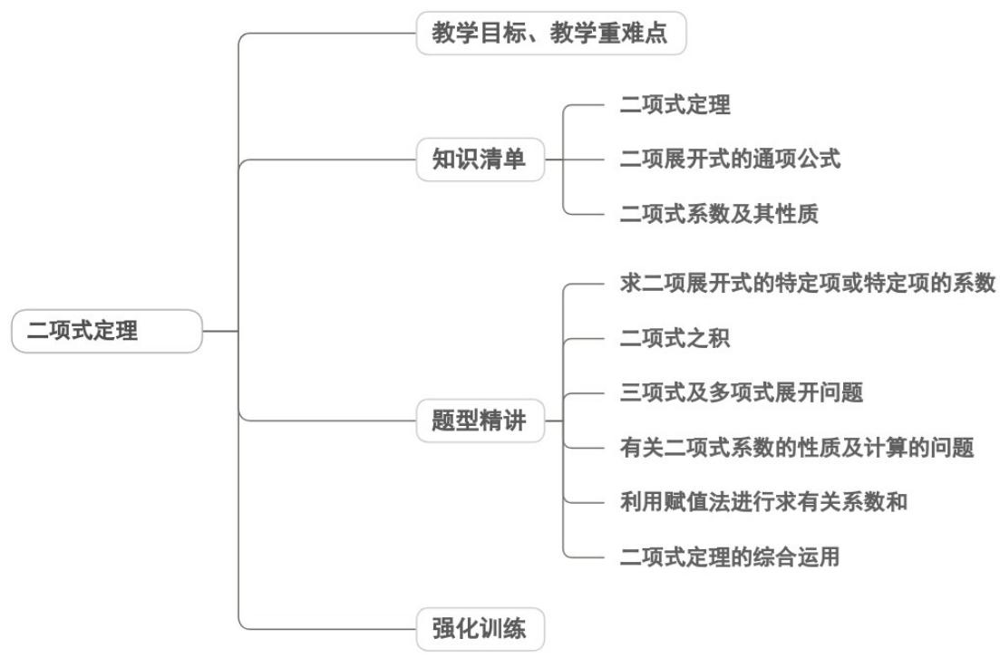

<!-- source-part:1 pages:1-44 -->

## 专题6.3 二项式定理

## 内容概览

## 教学目标、教学重难点

<table><tr><td>教学目标</td><td>1.理解二项式定理的本质内涵,能准确表述二项式定理的文字定义与数学公式,明确展开式的结构特征(如项数、字母幂次规律)。2.掌握二项展开式的通项公式,能辨析“二项式系数”与“项的系数”的区别与联系。3.能运用二项式定理解决简单的展开问题、指定项(如常数项、含某字母指定幂次的项)求解问题,以及二项式系数相关计算问题。4.会用计数原理(分步乘法计数原理、组合知识)证明二项式定理,理解定理的推导逻辑。</td></tr><tr><td>教学重难点</td><td>1.重点二项展开式通项公式的灵活运用,能根据需求求解指定项(如第k项、常数项、有理项)及相关系数。2.难点通项公式的灵活应用:在复杂情境(如含负号、系数非1的二项式,多项式乘积展开)中,准确确定参数a、b、n、k的值,避免混淆“第k+1项”与“第k项”。</td></tr></table>

![[高中/课堂同步/题库/人教A版高中数学同步讲义(2026)/05_选择性必修第三册/第六章 计数原理/讲义/专题6_3_二项式定理_高效培优讲义_/知识清单_sec_01/知识清单_sec_01.md]]
![[高中/课堂同步/题库/人教A版高中数学同步讲义(2026)/05_选择性必修第三册/第六章 计数原理/讲义/专题6_3_二项式定理_高效培优讲义_/知识点_01_二项式定理_sec_02/知识点_01_二项式定理_sec_02.md]]
![[高中/课堂同步/题库/人教A版高中数学同步讲义(2026)/05_选择性必修第三册/第六章 计数原理/讲义/专题6_3_二项式定理_高效培优讲义_/知识点_02_二项展开式的通项公式_sec_03/知识点_02_二项展开式的通项公式_sec_03.md]]
![[高中/课堂同步/题库/人教A版高中数学同步讲义(2026)/05_选择性必修第三册/第六章 计数原理/讲义/专题6_3_二项式定理_高效培优讲义_/知识点_03_二项式系数及其性质_sec_04/知识点_03_二项式系数及其性质_sec_04.md]]
![[高中/课堂同步/题库/人教A版高中数学同步讲义(2026)/05_选择性必修第三册/第六章 计数原理/讲义/专题6_3_二项式定理_高效培优讲义_/题型精讲_sec_05/题型精讲_sec_05.md]]
![[高中/课堂同步/题库/人教A版高中数学同步讲义(2026)/05_选择性必修第三册/第六章 计数原理/讲义/专题6_3_二项式定理_高效培优讲义_/题型01_求二项展开式的特定项或特定项的系数_sec_06/题型01_求二项展开式的特定项或特定项的系数_sec_06.md]]
![[高中/课堂同步/题库/人教A版高中数学同步讲义(2026)/05_选择性必修第三册/第六章 计数原理/讲义/专题6_3_二项式定理_高效培优讲义_/题型02_二项式之积_sec_07/题型02_二项式之积_sec_07.md]]
![[高中/课堂同步/题库/人教A版高中数学同步讲义(2026)/05_选择性必修第三册/第六章 计数原理/讲义/专题6_3_二项式定理_高效培优讲义_/题型03_三项式及多项式展开问题_sec_08/题型03_三项式及多项式展开问题_sec_08.md]]
![[高中/课堂同步/题库/人教A版高中数学同步讲义(2026)/05_选择性必修第三册/第六章 计数原理/讲义/专题6_3_二项式定理_高效培优讲义_/题型04_有关二项式系数的性质及计算的问题_sec_09/题型04_有关二项式系数的性质及计算的问题_sec_09.md]]
![[高中/课堂同步/题库/人教A版高中数学同步讲义(2026)/05_选择性必修第三册/第六章 计数原理/讲义/专题6_3_二项式定理_高效培优讲义_/题型05_利用赋值法进行求有关系数和_sec_10/题型05_利用赋值法进行求有关系数和_sec_10.md]]
![[高中/课堂同步/题库/人教A版高中数学同步讲义(2026)/05_选择性必修第三册/第六章 计数原理/讲义/专题6_3_二项式定理_高效培优讲义_/题型06_二项式定理的综合运用_sec_11/题型06_二项式定理的综合运用_sec_11.md]]
![[高中/课堂同步/题库/人教A版高中数学同步讲义(2026)/05_选择性必修第三册/第六章 计数原理/讲义/专题6_3_二项式定理_高效培优讲义_/强化训练_sec_12/强化训练_sec_12.md]]
