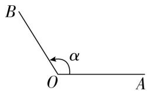
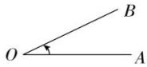
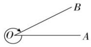

## 1. 角的相关概念

## (1) 角的概念

角可以看成一条射线绕着它的端点旋转所成的图形.

## (2) 角的表示

①始边:射线的起始位置OA;

②终边:射线的终止位置 OB ;

③顶点:射线的端点O;

④记法:图中的角 $\alpha$ 可记为 “角 $\alpha$ ” 或 “ $\angle\alpha$ ” 或 “ $\angle AOB$ ”, 可以简记成 “ $\alpha$ ”.

## (3) 角的分类

<table><tr><td>名称</td><td>定义</td><td>图形</td></tr><tr><td>正角</td><td>一条射线绕其端点按逆时针方向旋转形成的角</td><td></td></tr><tr><td>负角</td><td>一条射线绕其端点按顺时针方向旋转形成的角</td><td></td></tr><tr><td>零角</td><td>一条射线没有做任何旋转形成的角</td><td>A(B)</td></tr></table>
