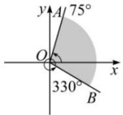

<!-- question-source:start -->
【28】（2023·高一课时练习）已知 $\alpha = -1920^{\circ}$

（1）将 $\alpha$ 写成 $\beta + 2k\pi (k \in \mathbb{Z}, 0 \leq \beta < 2\pi)$ 的形式, 并指出它是第几象限角

（2）求与 $\alpha$ 终边相同的角 $\theta$ ，满足 $-4\pi \leq \theta < 0$ 。

<!-- question-source:end -->

![[Q00004180A1]]
