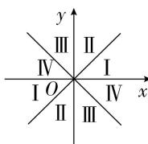
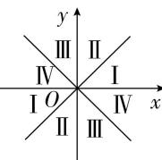
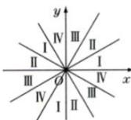

> [!faq]- 全练一本通解析
> **【解析】**
> 详见解析
> 
> 解: 如图
> 将坐标系的每个象限二等分, 得到 8 个区域. 自 x 轴正半轴按逆时针方向把每个区域依次标上 I, II, III, IV.
> ∵ $\alpha$ 是第二象限角, 与角 $\alpha$ 所在象限标号一致的区域（即标号为 II），即为 $\frac{\alpha}{2}$ 的终边所在的象限,
> ∴ $\frac{\alpha}{2}$ 的终边位于第一或第三象限.
> 如图, 将坐标系的每个象限三等分, 得到 12 个区域. 自 x 轴正半轴按逆时针方向把每个区域依次标上 I, II, III, IV.
> ∵ $\alpha$ 是第二象限角, 与角 $\alpha$ 所在象限标号一致的区域（即标号为 II）
> 
> 
> 即为 $\frac{\alpha}{3}$ 的终边所在的象限， $\therefore \frac{\alpha}{3}$ 的终边位于第一、第二或第四象限.
