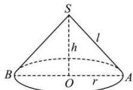

> [!faq]- 全练一本通解析
> **【答案】** $\frac{\sqrt{3}\pi}{3}$
>
> **【解析】**
> 设圆锥的底面半径为 r，母线长为 l，则 $\left\{\begin{aligned}\pi rl &= 2\pi \\ l\pi &= 2\pi r\end{aligned}\right.$
> 
> 解得 $\left\{ \begin{array}{l} r = 1 \\ l = 2 \end{array} \right.$ ，所以圆锥的高为 $h = \sqrt{l^2 - r^2} = \sqrt{3}$ ，故圆锥的体积为 $\frac{1}{3}\pi r^2 h = \frac{\sqrt{3}\pi}{3}$ 。故答案为： $\frac{\sqrt{3}\pi}{3}$
