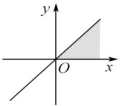
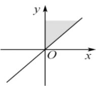
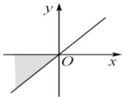
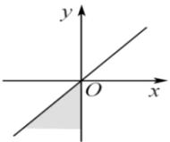

<!-- question-source:start -->
【11】已知 $\alpha\in\left\{\alpha\left|45^{\circ}+k\cdot360^{\circ}\leq\alpha\leq90^{\circ}+k\cdot360^{\circ}\right.\right\}$ 则角 $\alpha$ 的终边落在的阴影部分是（）

A.

B.

C.

D.

<!-- question-source:end -->

![[Q00006310A1]]
