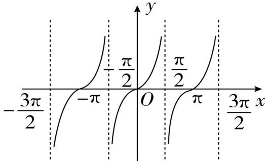

# 第七节 正切函数的图像与性质

# 第七节 正切函数的图像与性质

## 知识导学

## 1. 正切函数的概念

对于任意一个角 $x$ ，只要 $x \neq \frac{\pi}{2} + k\pi, k \in \mathbf{Z}$ ，就有唯一确定的正切值 $\tan x$ 与之对应，因此 $y = \tan x$ 是一个函数，称为正切函数。

## 2. 正切函数的图像

$y = \tan x$ 的函数图像称为正切曲线, 其图像如下, 由图可知, 正切曲线是中心对称图形, 其对称中心为 $\left(\frac{k\pi}{2}, 0\right)(k \in \mathbf{Z})$ .

## 3. 正切函数的性质

<table><tr><td>函数</td><td> $y = \tan x$ </td></tr><tr><td>定义域</td><td> $\left\{ x \mid x \neq \frac{\pi}{2} + k\pi, k \in \mathbf{Z} \right\}$ </td></tr><tr><td>值域</td><td> $\mathbf{R}$ </td></tr><tr><td>奇偶性</td><td>奇函数</td></tr><tr><td>周期性</td><td>周期: $k\pi (k \in \mathbf{Z}, k \neq 0)$ ,最小正周期: $\pi$ </td></tr><tr><td>单调性</td><td>在每一个 $\left(-\frac{\pi}{2} + k\pi, \frac{\pi}{2} + k\pi\right) (k \in \mathbf{Z})$ 上都是增函数</td></tr><tr><td>零点</td><td> $k\pi (k \in \mathbf{Z})$ </td></tr><tr><td>对称性</td><td>对称中心: $(\frac{k\pi}{2}, 0) (k \in \mathbf{Z})$ </td></tr></table>

注意：
（1）正、余弦曲线在整个定义域内是连续的,而正切曲线是由被互相平行的直线 $x=\frac{\pi}{2}+k\pi(k\in\mathbf{Z})$ 所隔开的无穷多支曲线组成的,因此定义域为 $\left\{x\mid x\neq\frac{\pi}{2}+k\pi,k\in\mathbf{Z}\right\}$
(2) 正切函数在定义域上不具有单调性.
（3）正切函数无单调递减区间，有无数个单调递增区间，在 $\left(-\frac{\pi}{2},\frac{\pi}{2}\right),\left(\frac{\pi}{2},\frac{3\pi}{2}\right),\cdots$ 上都是增函数.
(4) 正切函数的每个单调区间均为开区间, 不能写成闭区间, 也不能说正切函数在 $\left(-\frac{\pi}{2}, \frac{\pi}{2}\right) \cup \left(\frac{\pi}{2}, \frac{3\pi}{2}\right) \cup \cdots$ 上是增函数.

![[高中/课堂同步/题库/高中数学全练一本通/三角函数/第七节 正切函数的图像与性质/▶基础点 1_ 正切函数图像/▶基础点 1_ 正切函数图像.md]]
![[高中/课堂同步/题库/高中数学全练一本通/三角函数/第七节 正切函数的图像与性质/▶基础点 2_ 求正切函数的定义域/▶基础点 2_ 求正切函数的定义域.md]]
![[高中/课堂同步/题库/高中数学全练一本通/三角函数/第七节 正切函数的图像与性质/▶基础点 3_ 判断正切函数的周期/▶基础点 3_ 判断正切函数的周期.md]]
![[高中/课堂同步/题库/高中数学全练一本通/三角函数/第七节 正切函数的图像与性质/▶基础点 5_ 求正切函数的单调区间/▶基础点 5_ 求正切函数的单调区间.md]]
![[高中/课堂同步/题库/高中数学全练一本通/三角函数/第七节 正切函数的图像与性质/▶基础点 4_ 判断正切函数的奇偶性/▶基础点 4_ 判断正切函数的奇偶性.md]]
![[高中/课堂同步/题库/高中数学全练一本通/三角函数/第七节 正切函数的图像与性质/▶基础点6_正切函数比较大小/▶基础点6_正切函数比较大小.md]]
![[高中/课堂同步/题库/高中数学全练一本通/三角函数/第七节 正切函数的图像与性质/▶基础点 7_ 正切函数的的对称性/▶基础点 7_ 正切函数的的对称性.md]]
![[高中/课堂同步/题库/高中数学全练一本通/三角函数/第七节 正切函数的图像与性质/▶基础点 8_ 正切函数的值域/▶基础点 8_ 正切函数的值域.md]]
![[高中/课堂同步/题库/高中数学全练一本通/三角函数/第七节 正切函数的图像与性质/题型 1_ 利用奇偶性求值/题型 1_ 利用奇偶性求值.md]]
![[高中/课堂同步/题库/高中数学全练一本通/三角函数/第七节 正切函数的图像与性质/题型 2_ 正切函数周期的应用/题型 2_ 正切函数周期的应用.md]]
![[高中/课堂同步/题库/高中数学全练一本通/三角函数/第七节 正切函数的图像与性质/题型 3_ 利用正切函数单调性求参数/题型 3_ 利用正切函数单调性求参数.md]]
![[高中/课堂同步/题库/高中数学全练一本通/三角函数/第七节 正切函数的图像与性质/题型 4_ 对称性与周期性的应用/题型 4_ 对称性与周期性的应用.md]]
