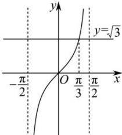
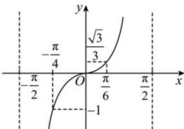

> [!faq]- 全练一本通解析
> **【解析】**
> 详见解析
> 解析：（1）在同一平面直角坐标系中作出正切函数 $y=\tan x$ 在 $x\in\left(-\frac{\pi}{2},\frac{\pi}{2}\right)$ 上的图象和直线 $y=\sqrt{3}$ ，如图：
> 
> 显然在 $\sin(2A+\frac{\pi}{3})=\frac{1}{2}$ 上， $x=\frac{\pi}{3}$ 满足 $\tan x=\sqrt{3}$ 由图可知在 $\sin(2A+\frac{\pi}{3})=\frac{1}{2}$ 上，
> 使不等式成立的 x 的取值范围是 $\frac{\pi}{3} \leq x < \frac{\pi}{2}$ .
> 所以使不等式成立的 x 的集合为 $\left[k\pi + \frac{\pi}{3}, k\pi + \frac{\pi}{2}\right), k \in Z$ .
> （2）作出函数 $y = \tan x, x \in \left(-\frac{\pi}{2}, \frac{\pi}{2}\right)$ 的图像，如图所示.
> 
> 观察图像可得: 在 $\left(-\frac{\pi}{2}, \frac{\pi}{2}\right)$ 内, 满足条件的 x 为 $-\frac{\pi}{4} \leq x \leq \frac{\pi}{6}$ ,
> 由正切函数的周期性可知, 满足不等式的 x 的解集为 $\left[-\frac{\pi}{4}+k\pi,\frac{\pi}{6}+k\pi\right],k\in Z.$ （3）由 $\tan\left(2x-\frac{\pi}{6}\right)\geq\frac{\sqrt{3}}{3}$ 得 $\frac{\pi}{6}+k\pi\leq2x-\frac{\pi}{6}<\frac{\pi}{2}+k\pi,k\in Z$ 解得 $\frac{\pi}{6}+\frac{k\pi}{2}\leq x<\frac{\pi}{3}+\frac{k\pi}{2},k\in Z$ 所以不等式的解集为 $\left[\frac{\pi}{6}+\frac{k\pi}{2},\frac{\pi}{3}+\frac{k\pi}{2}\right),k\in Z.$ 故答案为 $\left[\frac{\pi}{6}+\frac{k\pi}{2},\frac{\pi}{3}+\frac{k\pi}{2}\right),k\in Z.$ （4）因为 $y=\tan x$ 在 $\left(-\frac{\pi}{2}+k\pi,\frac{\pi}{2}+k\pi\right),k\in Z$ 上单调递增，
> 则由 $-1 \leq \tan\left(\frac{1}{2}x + \frac{\pi}{6}\right) \leq \sqrt{3}$ 得 $-\frac{\pi}{4} + k\pi \leq \frac{1}{2}x + \frac{\pi}{6} \leq \frac{\pi}{3} + k\pi, k \in Z$ 解得 $-\frac{5\pi}{6}+2k\pi\leq x\leq\frac{\pi}{3}+2k\pi,k\in Z$
> 即不等式 $-1 \leq \tan\left(\frac{1}{2}x + \frac{\pi}{6}\right) \leq \sqrt{3}$ 的解集是 $\left[-\frac{5\pi}{6} + 2k\pi, \frac{\pi}{3} + 2k\pi\right], k \in Z$ 故答案为： $\left[-\frac{5\pi}{6} + 2k\pi, \frac{\pi}{3} + 2k\pi\right], k \in Z$
