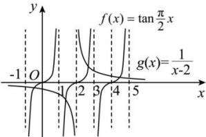

> [!faq]- 全练一本通解析
> **【答案】** C
>
> **【解析】**
> 解析： $f(x) = \tan\frac{\pi}{2}x$ ，T = 2，
> 令 $\frac{\pi}{2}x = \frac{k\pi}{2}$ ，则 x = k, k ∈ Z，所以函数 $f(x) = \tan\frac{\pi}{2}x$ 的对称中心为 $(k,0), k \in Z$ ，
> 因为 $g(x) = \frac{1}{x - 2}$ 是由函数 $y = \frac{1}{x}$ 向右平移 2 个单位得到的，
> 所以 $g(x) = \frac{1}{x - 2}$ 关于 (2,0) 对称，
> 故 (2,0) 是函数 $f(x) = \tan\frac{\pi}{2}x$ 和 $g(x) = \frac{1}{x - 2}$ 的对称中心，
> 画出两函数的图像如图所示：
> 
> 故两函数有四个交点，设从左到右依次为 $x_{1}, x_{2}, x_{3}, x_{4}$ ，根据对称性，则 $x_{1}, x_{2}$ 关于 $(2,0)$ 对称， $x_{3}, x_{4}$ 也关于 $(2,0)$ 对称，所以 $x_{1} + x_{2} + x_{3} + x_{4} = 8$ ，即函数 $f(x) = \tan \frac{\pi}{2} x$ 和 $g(x) = \frac{1}{x - 2}$ 的图象在区间 $(-1,5)$ 上交点的横坐标之和为8.
>
> 故选 **C**.
