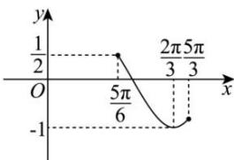

> [!faq]- 全练一本通解析
> **【解析】**
> （1） $\left[-\frac{5\pi}{12}+k\pi,\frac{\pi}{12}+k\pi\right](k\in Z)$ ; （2） $[-2,1]$ 解析：（1） $f(x)=4\cos x\sin\left(x+\frac{\pi}{3}\right)-\sqrt{3}=4\cos x\left(\frac{1}{2}\sin x+\frac{\sqrt{3}}{2}\cos x\right)-\sqrt{3}$ $=2\tan x\tan x+2\tan3\tan x-\sqrt{3}=\tan x+2\tan3\times\frac{1+\cos 2x}{2}-\sqrt{3}$ $=\sin 2x+\sqrt{3}\cos 2x=2\sin\left(2x+\frac{\pi}{3}\right)$ 令 $-\frac{\pi}{2}+2k\pi\leq2x+\frac{\pi}{3}\leq\frac{\pi}{2}+2k\pi(k\in Z)$ ,
> 解得 $-\frac{5\pi}{12}+k\pi\leq x\leq\frac{\pi}{12}+k\pi(k\in Z)$ 所以 $f(x)$ 的单调递增区间为 $\left[-\frac{5\pi}{12}+k\pi,\frac{\pi}{12}+k\pi\right](k\in Z)$ ;
> （2）当 $x \in \left[\frac{\pi}{4}, \frac{2\pi}{3}\right]$ 时 $2x + \frac{\pi}{3} \in \left[\frac{5\pi}{6}, \frac{5\pi}{3}\right]$ ，所以 $\sin\left(2x+\frac{\pi}{3}\right)\in[-1,\frac{1}{2}]$ ，如图所示，
> 
> 所以 $f(x)=2\sin\left(2x+\frac{\pi}{3}\right)\in[-2,1]$ ，所以 $f(x)$ 在区间 $\left[\frac{\pi}{4},\frac{2\pi}{3}\right]$ 上的值域为 $[-2,1]$ .
