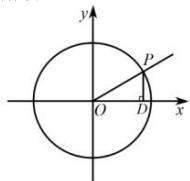
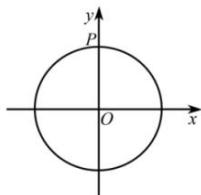
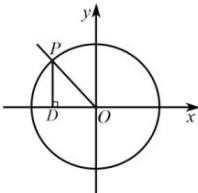
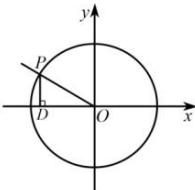
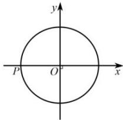
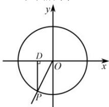

> [!faq]- 全练一本通解析
> **【答案】** 详见解析
>
> **【解析】**
> （1）如图所示，
> 
> $\frac{\pi}{6}$ 的终边与单位圆的交点为 P，过点 P 作 $PD \perp x$ 轴于点 D，在 $\triangle OPD$ 中， $|OP|=1,\angle POD=\frac{\pi}{6}$ ，则 $|PD|=\frac{1}{2},|OD|=\frac{\sqrt{3}}{2}$ ，则 $P\left(\frac{\sqrt{3}}{2},\frac{1}{2}\right)$ .
> 所以 $\sin \frac{\pi}{6} = \frac{\frac{1}{2}}{1} = \frac{1}{2},\cos \frac{\pi}{6} = \frac{\frac{\sqrt{3}}{2}}{1} = \frac{\sqrt{3}}{2},\tan \frac{\pi}{6} = \frac{\frac{1}{2}}{\frac{\sqrt{3}}{2}} = \frac{\sqrt{3}}{3}.$
> (2) 如图所示,
> 
> $\frac{\pi}{2}$ 的终边与单位圆的交点为 P，由图可知 $P(0,1)$ 。所以 $\sin\frac{\pi}{2}=\frac{1}{1}=1$ $\cos\frac{\pi}{2}=\frac{0}{1}=0,\tan\frac{\pi}{2}$ 不存在.
> （3）如图所示，
> 
> $\frac{3\pi}{4}$ 的终边与单位圆的交点为 P，过点 P 作 $PD \perp x$ 轴于点 D，在 $\triangle OPD$ 中， $|OP|=1,\angle POD=\frac{\pi}{4}$ ，则 $|PD|=\frac{\sqrt{2}}{2},|OD|=\frac{\sqrt{2}}{2}$ ，则 $P\left(-\frac{\sqrt{2}}{2},\frac{\sqrt{2}}{2}\right)$ 。所以 $\sin\frac{3\pi}{4}=\frac{\sqrt{2}}{2},\cos\frac{3\pi}{4}=-\frac{\sqrt{2}}{2},\tan\frac{3\pi}{4}=-1$ 。
> (4) 如图所示,
> 
> $\frac{5\pi}{6}$ 的终边与单位圆的交点为 P，过点 P 作 $PD \perp x$ 轴于点 D，在 $\triangle OPD$ 中， $|OP|=1$ ， $\angle POD=\frac{\pi}{6}$ ，则 $|PD|=\frac{1}{2}$ ， $|OD|=\frac{\sqrt{3}}{2}$ ，则 $P\left(-\frac{\sqrt{3}}{2},\frac{1}{2}\right)$ 。所以 $\sin\frac{5\pi}{6}=\frac{1}{2}$ ， $\cos\frac{5\pi}{6}=-\frac{\sqrt{3}}{2}$ ， $\tan\frac{5\pi}{6}=-\frac{\sqrt{3}}{3}$ 。
> 
> $\pi$ 的终边与单位圆的交点为 P，由图可知 $P(-1,0)$ ．所以 $\sin\frac{\pi}{2}=0$ ， $\cos\frac{\pi}{2}=-1,\quad\tan\frac{\pi}{2}=0.$
> (6) 如图所示,
> 
> $\frac{4\pi}{3}$ 的终边与单位圆的交点为 P，过点 P 作 $PD \perp x$ 轴于点 D，在 $\triangle OPD$ 中， $|OP| = 1$ ， $\angle POD = \frac{\pi}{3}$ ，则 $|PD| = \frac{\sqrt{3}}{2}$ ， $|OD| = \frac{1}{2}$ ，则 $P\left(-\frac{1}{2}, -\frac{\sqrt{3}}{2}\right)$ 。所以 $\sin \frac{4\pi}{3} = -\frac{\sqrt{3}}{2}$ ， $\cos \frac{4\pi}{3} = -\frac{1}{2}$ ， $\tan \frac{4\pi}{3} = \sqrt{3}$ 。
