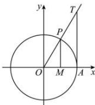
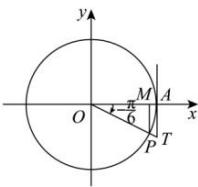
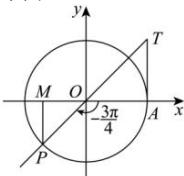
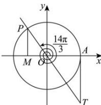

> [!faq]- 全练一本通解析
> **【答案】** 答案见解析
>
> **【解析】**
> （1）作出单位圆，交角 $\frac{\pi}{3}$ 的终边于 $P$
> 过 P 作 $PM \perp x$ 轴, 交 x 轴于 M,
> 过点 $A(1,0)$ 作 $y$ 轴平行线，交角 $\frac{\pi}{3}$ 的终边于 $T$ ，如图：
> 
> 则角 $\frac{\pi}{3}$ 的正弦线为 $\overrightarrow{MP}$ 、余弦线为 $\overrightarrow{OM}$ 、正切线为 $\overrightarrow{AT}$ ；
> （2）作出单位圆，交角 $-\frac{\pi}{6}$ 的终边于 $P$ ，
> 过 $P$ 作 $PM \perp x$ 轴，交 $x$ 轴于 $M$ ，
> 过点 $A(1,0)$ 作 $y$ 轴平行线，交角 $-\frac{\pi}{6}$ 的终边于 $T$ ，如下图：
> 
> 则角 $-\frac{\pi}{6}$ 的正弦线为 $\overrightarrow{MP}$ 、余弦线为 $\overrightarrow{OM}$ 、正切线为 $\overrightarrow{AT}$ ；
> （3）作出单位圆，交角 $-\frac{3\pi}{4}$ 的终边于 $P$ ，过 $P$ 作 $PM \perp x$ 轴，交 $x$ 轴于 $M$ ，过点 $A(1,0)$ 作 $y$ 轴平行线，交角 $-\frac{3\pi}{4}$ 的终边的反向延长线于 $T$ ，如下图：
> 
> 则角 $-\frac{3\pi}{4}$ 的正弦线为 $\overrightarrow{MP}$ 、余弦线为 $\overrightarrow{OM}$ 、正切线为 $\overrightarrow{AT}$ ；
> （4）作出单位圆，交角 $\frac{14\pi}{3}$ 的终边于 P，
> $$
> P M \perp x
> $$
> $$
> M
> $$
> 过点 $A(1,0)$ 作 $y$ 轴平行线，交角 $\frac{14\pi}{3}$ 的终边的反向延长线于 $T$ ，如下图：
> 
> 则角 $\frac{14\pi}{3}$ 的正弦线为 $\overrightarrow{MP}$ 、余弦线为 $\overrightarrow{OM}$ 、正切线为 $\overrightarrow{AT}$ ：
