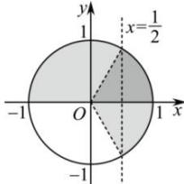

> [!faq]- 全练一本通解析
> **【解析】**
> $\{x\mid2k\pi\leq x<2k\pi+\frac{\pi}{3},k\in\mathbf{Z}\}$ .
> 解析：由 $\left\{\begin{aligned}\sin x&\geq0\\ 2\cos x&-1>0\end{aligned}\right.$ ，得 $\left\{\begin{aligned}\sin x&\geq0\\ \cos x&>\frac{1}{2}\end{aligned}\right.$ 在直角坐标系中作单位圆，如图所示，
> 
> 由三角函数线可得:
> $\left\{ \begin{array}{l} 2k\pi \leq x \leq 2k\pi + \pi, k \in \mathbf{Z} \\ 2k\pi - \frac{\pi}{3} < x < 2k\pi + \frac{\pi}{3}, k \in \mathbf{Z} \end{array} \right.$
> 解集恰好为图中阴影重叠的部分, 故原不等式组的解集为 $\{x\mid2k\pi\leq x<2k\pi+\frac{\pi}{3},k\in\mathbf{Z}\}$
