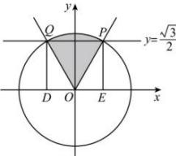
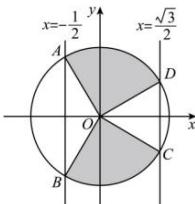

> [!faq]- 全练一本通解析
> **【答案】** （1） $\frac{\pi}{3}+2k\pi\leq\theta\leq\frac{2\pi}{3}+2k\pi,k\in Z$ (2) $-\frac{2}{3}\pi+2k\pi\leq\theta<-\frac{\pi}{6}+2k\pi$ 或 $\frac{\pi}{6}+2k\pi<\theta\leq\frac{2}{3}\pi+2k\pi,k\in Z$
>
> **【解析】**
> （1）下图中阴影部分就是满足条件的角 $\theta$ 的范围，即 $\frac{\pi}{3} + 2k\pi \leq \theta \leq \frac{2\pi}{3} + 2k\pi, k \in Z$ ；
> 
> （2）下图中阴影部分就是满足条件的角 $\theta$ 的范围，即 $-\frac{2}{3}\pi + 2k\pi \leq \theta < -\frac{\pi}{6} + 2k\pi$ 或 $\frac{\pi}{6} + 2k\pi < \theta \leq \frac{2}{3}\pi + 2k\pi, k \in Z$ ；
> 
> 故答案为： $\frac{\pi}{3}+2k\pi\leq\theta\leq\frac{2\pi}{3}+2k\pi,k\in Z$ $-\frac{2}{3}\pi+2k\pi\leq\theta<-\frac{\pi}{6}+2k\pi$ 或 $\frac{\pi}{6}+2k\pi<\theta\leq\frac{2}{3}\pi+2k\pi,k\in Z$
