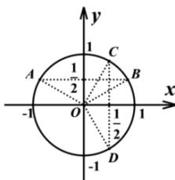

> [!faq]- 全练一本通解析
> **【答案】** $\left[2k\pi+\frac{\pi}{3},2k\pi+\frac{5\pi}{6}\right](k\in\mathbf{Z})$
>
> **【解析】**
> 要使原函数有意义,有 $\left\{\begin{aligned}&2\sin x-1>0\\ &1-2\cos x\geq0\end{aligned}\right.$ ，即 $\left\{\begin{aligned}\sin x>\frac{1}{2}\\ \cos x\leq\frac{1}{2}\end{aligned}\right.$ .
> 如图, 在单位圆中由 $\sin x > \frac{1}{2}$ 可知角 x 的终边落在由 OA, OB 及劣弧 AB 围成的区域内（不含边界）.
> 由 $\cos x \leq \frac{1}{2}$ 可知角 x 的终边落在由 OC, OD 及优弧 CD 围成的区域内（含边界）,
> 所以 $\left\{\begin{aligned}&2k\pi+\frac{\pi}{6}<x<2k\pi+\frac{5\pi}{6}(k\in\mathbf{Z})\\&2k\pi+\frac{\pi}{3}\leq x\leq2k\pi+\frac{5\pi}{3}(k\in\mathbf{Z})\end{aligned}\right.$ 所以原函数的定义域为 $\left[2k\pi+\frac{\pi}{3},2k\pi+\frac{5\pi}{6}\right](k\in\mathbf{Z})$ .
> 
