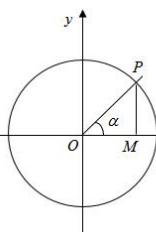

> [!faq]- 全练一本通解析
> **【答案】** 证明见详解.
>
> **【解析】**
> 
> 当角 $\alpha$ 的终边在 $x$ 轴上时，正弦线变成一个点，余弦线的长等于单位圆的半径，此时 $|\sin \alpha| + |\cos \alpha| = 1$ ；
> 当角 $\alpha$ 的终边在 $y$ 轴上时，余弦线变成一个点，正弦线的长等于单位圆的半径, 此时 $\left|\sin\alpha\right|+\left|\cos\alpha\right|=1$ ;
> 当角 $\alpha$ 的终边落在四个象限时, 设角 $\alpha$ 的终边与单位圆交于点 $P(x,y)$ 时, 过点 P 作 $PM \perp x$ 轴于点 M, 则 $\left|\sin\alpha\right|=\left|MP\right|$ , $\left|\cos\alpha\right|=\left|OM\right|$ ,
> 利用三角形两边之和大于第三边有： $\left|\sin\alpha\right|+\left|\cos\alpha\right|=\left|MP\right|+\left|OM\right|>1$ 综上， $\left|\sin\alpha\right|+\left|\cos\alpha\right|\geq1$
