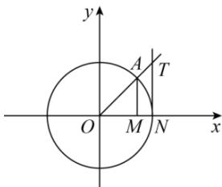

> [!faq]- 全练一本通解析
> **【解析】**
> 证明见解析；
> 解析: 证明: 在单位圆中, 有 $\sin\alpha = AM, \cos\alpha = OM$ 连接 AN, 则 $S_{zOAN} < S_{扇形OAN} < S_{zONT}$ 即 $\frac{1}{2}ON \cdot MA < \frac{1}{2}ON^{2} \cdot \alpha < \frac{1}{2}ON \cdot NT$ , MA < $\alpha < NT$ , $\therefore \sin\alpha < \alpha < \tan\alpha$ .
> 
