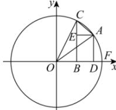

> [!faq]- 全练一本通解析
> **【答案】** 证明见解析
>
> **【解析】**
> 作单位圆如下图, $\angle AOF=\alpha=\widehat{AF},\angle COF=\beta=\widehat{CF}$ ，且 $\sin\alpha=DA>0,\sin\beta=BC>0,\beta-\alpha=\widehat{CA}$ 过 A 作 $AE \perp CB$ 于 E，连接 AC，则 BE = DA，故 $EC = \sin \beta - \sin \alpha$ ，由 $EC < AC < \widehat{CA}$ ，则 $\sin \beta - \sin \alpha < \beta - \alpha$ ，即 $\beta - \sin \beta > \alpha - \sin \alpha$ 。
> 
