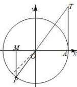

> [!faq]- 全练一本通解析
> **【答案】** D
>
> **【解析】**
> 解析:作出 4 弧度角的正弦线、余弦线和正切线如下图所示, 则 $MP = \sin \alpha$ , $OM = \cos \alpha$ , $AT = \tan \alpha$ , 其中虚线表示的是角 $\frac{5\pi}{4}$ 的终边, $\because 4 > \frac{5\pi}{4}$ , 则 $MP < OM < 0 < AT$ , 即 $\sin 4 < \cos 4 < \tan 4$ .
> 故选:D.
> 
