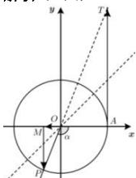

> [!faq]- 全练一本通解析
> **【答案】** D
>
> **【解析】**
> 解析:如图,
> 
> 在单位圆中, 作出 $(- \frac{3\pi}{4}, -\frac{\pi}{2})$ 内的一个角 $\alpha$ 及其正弦线 $\overrightarrow{MP}$ 、余弦线 $\overrightarrow{OM}$ 、正切线 $\overrightarrow{AT}$ . 由图知, $|\overrightarrow{OM}| < |\overrightarrow{MP}| < |\overrightarrow{AT}|$ , 又 $\overrightarrow{OM}, \overrightarrow{MP}$ 分别与 $x$ 轴、 $y$ 轴的正方向相反, 而 $\overrightarrow{AT}$ 与 $y$ 轴的正方向相同, 所以 $\sin \alpha < \cos \alpha < \tan \alpha$ .
>
> 故选 **D**
