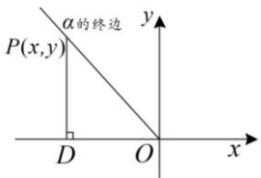

## 知识导学

1. 任意角的正弦、余弦、正切的定义

tan $\alpha$

<table><tr><td>前提</td><td colspan="2">如图,对于任意角α来说,设P(x,y)是α终边上异于原点的任意一点,r=√x2+y2,</td><td></td></tr><tr><td rowspan="4">定义</td><td>正弦</td><td colspan="2">称y/r为角α的正弦,记作sinα,即sinα=y/r</td></tr><tr><td>余弦</td><td colspan="2">称x/r为角α的余弦,记作cosα,即cosα=x/r</td></tr><tr><td>正切</td><td colspan="2">当角α的终边不在y轴上时,称y/x为角α的正切,记作tanα,即tanα=y/x.</td></tr><tr><td>三角函数</td><td colspan="2">角α的正弦,余弦,正切都称为α的三角函数</td></tr></table>

![[高中/课堂同步/题库/高中数学全练一本通/三角函数/第二节 三角函数的定义/知识导学/2. 三角函数值的符号/2. 三角函数值的符号.md]]
![[高中/课堂同步/题库/高中数学全练一本通/三角函数/第二节 三角函数的定义/知识导学/3. 特殊角的三角函数值/3. 特殊角的三角函数值.md]]
![[高中/课堂同步/题库/高中数学全练一本通/三角函数/第二节 三角函数的定义/知识导学/4. 单位圆与三角函数/4. 单位圆与三角函数.md]]
![[高中/课堂同步/题库/高中数学全练一本通/三角函数/第二节 三角函数的定义/知识导学/5. 三角函数线/5. 三角函数线.md]]
