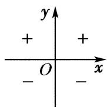
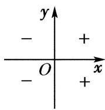
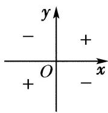
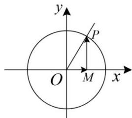
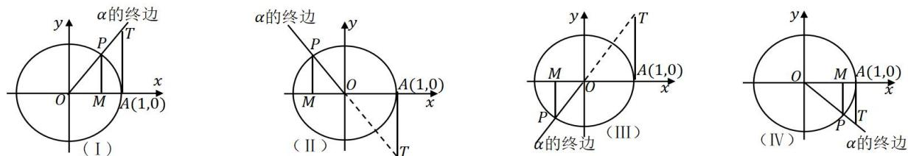

# 第二节 三角函数的定义

# 第二节 三角函数的定义

## 知识导学

1. 任意角的正弦、余弦、正切的定义

tan $\alpha$

<table><tr><td>前提</td><td colspan="2">如图,对于任意角α来说,设P(x,y)是α终边上异于原点的任意一点,r=√x2+y2,</td><td></td></tr><tr><td rowspan="4">定义</td><td>正弦</td><td colspan="2">称y/r为角α的正弦,记作sinα,即sinα=y/r</td></tr><tr><td>余弦</td><td colspan="2">称x/r为角α的余弦,记作cosα,即cosα=x/r</td></tr><tr><td>正切</td><td colspan="2">当角α的终边不在y轴上时,称y/x为角α的正切,记作tanα,即tanα=y/x.</td></tr><tr><td>三角函数</td><td colspan="2">角α的正弦,余弦,正切都称为α的三角函数</td></tr></table>

## 2. 三角函数值的符号

规律:一全正、二正弦、三正切、四余弦.

注意：（1）正切函数 $\tan\alpha=\frac{y}{x}$ ，所以在角 $\alpha$ 在 $\alpha=\frac{\pi}{2}+k\pi, k\in Z$ 没有意义.

（2）三角函数值的大小与点 $P(x,y)$ 在角 $\alpha$ 终边上的位置无关, 只由角 $\alpha$ 的终边位置决定, 即三角函数值的大小只与角有关.

（3）终边相等的角的同名三角函数值相等.

## 3. 特殊角的三角函数值

<table><tr><td></td><td> $0^{\circ}$ </td><td> $30^{\circ}$ </td><td> $45^{\circ}$ </td><td> $60^{\circ}$ </td><td> $90^{\circ}$ </td><td> $120^{\circ}$ </td><td> $135^{\circ}$ </td><td> $150^{\circ}$ </td><td> $180^{\circ}$ </td><td> $270^{\circ}$ </td></tr><tr><td></td><td>0</td><td> $\frac{\pi}{6}$ </td><td> $\frac{\pi}{4}$ </td><td> $\frac{\pi}{3}$ </td><td> $\frac{\pi}{2}$ </td><td> $\frac{2\pi}{3}$ </td><td> $\frac{3\pi}{4}$ </td><td> $\frac{5\pi}{6}$ </td><td> $\pi$ </td><td> $\frac{3\pi}{2}$ </td></tr><tr><td> $\sin \alpha$ </td><td>0</td><td> $\frac{1}{2}$ </td><td> $\frac{\sqrt{2}}{2}$ </td><td> $\frac{\sqrt{3}}{2}$ </td><td>1</td><td> $\frac{\sqrt{3}}{2}$ </td><td> $\frac{\sqrt{2}}{2}$ </td><td> $\frac{1}{2}$ </td><td>0</td><td>-1</td></tr><tr><td> $\cos \alpha$ </td><td>1</td><td> $\frac{\sqrt{3}}{2}$ </td><td> $\frac{\sqrt{2}}{2}$ </td><td> $\frac{1}{2}$ </td><td>0</td><td> $-\frac{1}{2}$ </td><td> $-\frac{\sqrt{2}}{2}$ </td><td> $-\frac{\sqrt{3}}{2}$ </td><td>-1</td><td>0</td></tr><tr><td> $\tan \alpha$ </td><td>0</td><td> $\frac{\sqrt{3}}{3}$ </td><td>1</td><td> $\sqrt{3}$ </td><td></td><td> $-\sqrt{3}$ </td><td>-1</td><td> $-\frac{\sqrt{3}}{3}$ </td><td>0</td><td></td></tr></table>

## 4. 单位圆与三角函数

定义:一般地,在平面直角坐标系中,坐标满足 $x^{2}+y^{2}=1$ 的点组成的集合称为单位圆.即圆心在原点,半径为1的圆.
如果角 $\alpha$ 的终边与单位圆的交点为 $P(x,y)$ ，根据三角函数定义 $\sin\alpha=\frac{y}{\sqrt{x^{2}+y^{2}}}$ ，因为 $P(x,y)$ 在单位圆上，所以 $\sqrt{x^{2}+y^{2}}=1$ ，所以 $\sin\alpha=y,\cos a=x,\tan\alpha=\frac{y}{x}$ ，这也是三角函数的等价定义.

## 5. 三角函数线

如图, 过角 $\alpha$ 终边与单位圆的交点 P 作 x 轴的垂线, 垂足为 M.

余弦线:称 $\overrightarrow{OM}$ 为角 $\alpha$ 的余弦线.

正弦线:称 $\overrightarrow{MP}$ 为角 $\alpha$ 的正弦线.

特征：

正弦线的方向同纵坐标轴一致, 向上为正, 向下为负;

余弦线的方向同横坐标轴一致, 向右为正, 向左为负.

正切线:如图,设角 $\alpha$ 的终边或其反向延长线与直线 x=1 交于点 T, 则 $\overrightarrow{AT}$ 可以直观地表示 $\tan\alpha$ , 因此 $\overrightarrow{AT}$ 称为角 $\alpha$ 的正切线.

注意：

（1）三角函数线是向量, 所以要注意向量的方向

（2）在第二或第三象限的正切线为其反向延长线与 $x = 1$ 的交点.

## ▶ ▷ 核心基础达标

![[高中/课堂同步/题库/高中数学全练一本通/三角函数/第二节 三角函数的定义/▶基础点 1_ 利用三角函数定义求值/▶基础点 1_ 利用三角函数定义求值.md]]
![[高中/课堂同步/题库/高中数学全练一本通/三角函数/第二节 三角函数的定义/▶基础点 2_ 已知三角函数值求参数/▶基础点 2_ 已知三角函数值求参数.md]]
![[高中/课堂同步/题库/高中数学全练一本通/三角函数/第二节 三角函数的定义/▶基础点 3_ 判断三角函数值的正负/▶基础点 3_ 判断三角函数值的正负.md]]
![[高中/课堂同步/题库/高中数学全练一本通/三角函数/第二节 三角函数的定义/▶基础点 4_作三角函数线/▶基础点 4_作三角函数线.md]]
![[高中/课堂同步/题库/高中数学全练一本通/三角函数/第二节 三角函数的定义/▶基础点 5_ 求单位圆中角的终边/▶基础点 5_ 求单位圆中角的终边.md]]
![[高中/课堂同步/题库/高中数学全练一本通/三角函数/第二节 三角函数的定义/题型1_利用三角函数线比较大小/题型1_利用三角函数线比较大小.md]]
![[高中/课堂同步/题库/高中数学全练一本通/三角函数/第二节 三角函数的定义/题型 2_ 利用三角函数线解不等式/题型 2_ 利用三角函数线解不等式.md]]
![[高中/课堂同步/题库/高中数学全练一本通/三角函数/第二节 三角函数的定义/题型 3_ 利用三角函数线证明不等式/题型 3_ 利用三角函数线证明不等式.md]]
