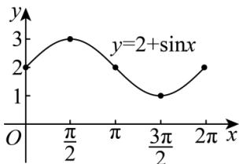
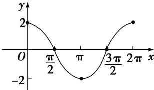
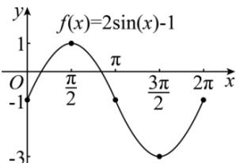
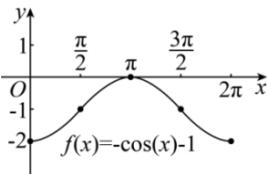

> [!faq]- 全练一本通解析
> **【解析】**
> 图象见解析
> 解析：（1）按五个关键点列表：
> <table><tr><td>x</td><td>0</td><td> $\frac{\pi}{2}$ </td><td>π</td><td> $\frac{3\pi}{2}$ </td><td>2π</td></tr><tr><td>sin x</td><td>0</td><td>1</td><td>0</td><td>-1</td><td>0</td></tr><tr><td>2+sin x</td><td>2</td><td>3</td><td>2</td><td>1</td><td>2</td></tr></table>
> 描点并将它们用光滑的曲线连接起来, 如图所示
> 
> (2) 列表:
> <table><tr><td>x</td><td>0</td><td> $\frac{\pi}{2}$ </td><td> $\pi$ </td><td> $\frac{3\pi}{2}$ </td><td> $2\pi$ </td></tr><tr><td> $\cos x$ </td><td>0</td><td>1</td><td>-1</td><td>0</td><td>1</td></tr><tr><td> $2\cos x$ </td><td>2</td><td>0</td><td>-2</td><td>0</td><td>2</td></tr></table>
> 描点连线如图:
> 
> （3）列表：
> <table><tr><td>x</td><td>0</td><td> $\frac{\pi}{2}$ </td><td> $\pi$ </td><td> $\frac{3\pi}{2}$ </td><td> $2\pi$ </td></tr><tr><td>sin x</td><td>0</td><td>1</td><td>0</td><td>-1</td><td>0</td></tr><tr><td> $2\sin x - 1$ </td><td>-1</td><td>1</td><td>-1</td><td>-3</td><td>-1</td></tr></table>
> 描点作图, 如图所示:
> 
> （4）列表：
> <table><tr><td>x</td><td>0</td><td> $\frac{\pi}{2}$ </td><td> $\pi$ </td><td> $\frac{3\pi}{2}$ </td><td> $2\pi$ </td></tr><tr><td> $\cos x$ </td><td>0</td><td>1</td><td>-1</td><td>0</td><td>1</td></tr><tr><td> $-1 - \cos x$ </td><td>-2</td><td>-1</td><td>0</td><td>-1</td><td>-2</td></tr></table>
> 描点作图, 如图所示.
> 
