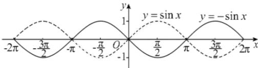
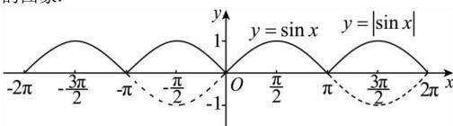
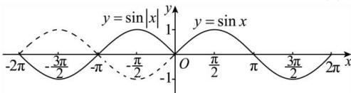

> [!faq]- 全练一本通解析
> **【答案】** 答案见解析
>
> **【解析】**
> （1）该图象与 $y=\sin x$ 的图象关于 x 轴对称，故将 $y=\sin x$ 的图象作关于 x 轴对称的图象即可得到 $y=-\sin x$ 的图象.
> 
> (2) $y = |\sin x| = \begin{cases} \sin x, -2\pi \leq x \leq -\pi, 0 \leq x \leq \pi, \\ -\sin x, -\pi \leq x \leq 0, \pi \leq x \leq 2\pi, \end{cases}$ 将 $y = \sin x$ 的图象在 $x$ 轴上方部分保持不变，下半部分作关于 $x$ 轴对称的图形，即可得到 $y = |\sin x|$ 的图象.
> 
> （3） $y=\sin\left|x\right|=\begin{cases}\sin x,x\geq0,\\-\sin x,x<0,\end{cases}$ 将 $y=\sin x$ 的图象在 y 轴右边部分保持不变，并将其作关于 y 轴对称的图形，即可得到 $y=\sin\left|x\right|$ 的图象.
> 
