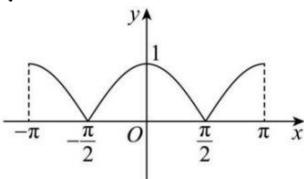

> [!faq]- 全练一本通解析
> **【答案】** 图像见解析
>
> **【解析】**
> 由三角函数的基本关系式, 可得 $y=\sqrt{1-\sin^{2}x}=\sqrt{\cos^{2}x}=\left|\cos x\right|$ ,
> 当 $x \in [-\pi, -\frac{\pi}{2})$ 时, 函数 $y = -\cos x$ ;
> 当 $x \in [-\frac{\pi}{2}, \frac{\pi}{2})$ 时, 函数 $y = \cos x$ ;
> 当 $x \in [\frac{\pi}{2}, \pi]$ 时, 函数 $y = -\cos x$ ;
> 结合余弦函数的图象, 可得函数 $y = \sqrt{1 - \sin^{2}x}, x \in [-\pi, \pi]$ 图象, 如图所示:
> 
