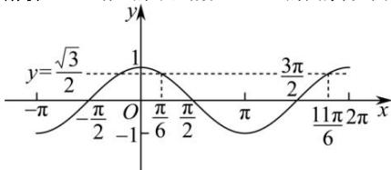
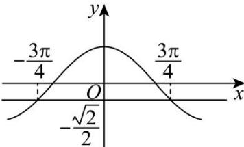
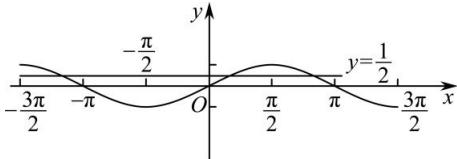
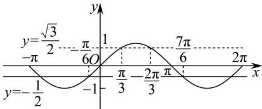

> [!faq]- 全练一本通解析
> **【答案】** 详见解析
>
> **【解析】**
> （1）作出余弦函数 $y = \cos x$ 的图象, 如图:
> 
> 求出 $y = \frac{\sqrt{3}}{2}$ 与 $y = \cos x$ 的图象的交点，并观察满足不等式的范围由图象可知，当 $\cos \theta < \frac{\sqrt{3}}{2}$ 时， $2k\pi + \frac{\pi}{6} < \theta < 2k\pi + \frac{11}{6}\pi (k \in \mathbb{Z})$ .
> （2）作出正弦函数 $y = \cos x$ 的图象，如图：
> 
> 求出 $y = \frac{\sqrt{2}}{2}$ 与 $y = \cos x$ 的图象的交点，并观察满足不等式的范围由图象可知，满足 $\cos x \geq -\frac{\sqrt{2}}{2}$ 成立的 $x$ 的取值集合为 $\left\{x\mid-\frac{3\pi}{4}+2k\pi\leq x\leq\frac{3\pi}{4}+2k\pi,\quad k\in Z\right\}$
> （3）画出 $y=\sin x$ 的图像如下图所示，
> 
> 由图可知, 不等 $\sin x \leq \frac{1}{2}$ 的解集为 $\left\{x \mid 2k\pi - \frac{7\pi}{6} \leq x \leq 2k\pi + \frac{\pi}{6}, k \in Z\right\}$
> 故答案为： $\left\{x\middle |2k\pi -\frac{7\pi}{6}\leq x\leq 2k\pi +\frac{\pi}{6},k\in \mathbf{Z}\right\}$
> （4）作出正弦函数 $y=\sin x$ 的图象, 如图:
> 
> 求出 $y = \frac{\sqrt{3}}{2}$ ， $y = -\frac{1}{2}$ 与 $y = \sin x$ 的图象的交点，并观察满足不等式的范围。由图象可知，当 $-\frac{1}{2} \leq \sin \theta < \frac{\sqrt{3}}{2}$ 时， $-\frac{\pi}{6} + 2k\pi \leq \theta < 2k\pi + \frac{\pi}{3}$ 或 $2k\pi + \frac{2}{3}\pi < \theta \leq 2k\pi + \frac{7}{6}\pi (k \in \mathbb{Z})$ 。
