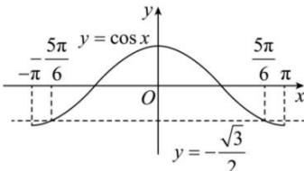

> [!faq]- 全练一本通解析
> **【答案】** $\left[-\frac{5\pi}{6},\frac{5\pi}{6}\right]$
>
> **【解析】**
> ∵ $2\cos x + \sqrt{3} \geq 0$ ，则 $\cos x \geq -\frac{\sqrt{3}}{2}$ ，
> 注意到 $x \in [-\pi, \pi]$ ，结合余弦函数图象解得 $x \in \left[-\frac{5\pi}{6}, \frac{5\pi}{6}\right]$ .
> 
