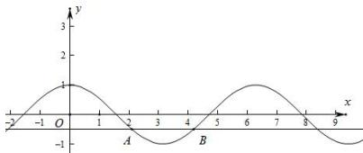

> [!faq]- 全练一本通解析
> **【解析】**
> $\left(\frac{2\pi}{3},\frac{4\pi}{3}\right)$
> 解析: $\because 2\cos x + 1 < 0$ ,
> $\therefore \cos x < -\frac{1}{2}$
> 根据余弦曲线可得，
> 
> ∴ $x \in \left( \frac{2\pi}{3}, \frac{4\pi}{3} \right)$ . 故答案为: $\left( \frac{2\pi}{3}, \frac{4\pi}{3} \right)$
