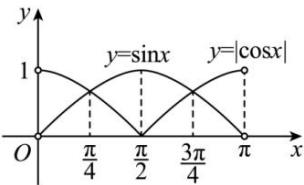

> [!faq]- 全练一本通解析
> **【解析】**
> $\left(\frac{\pi}{4},\frac{3\pi}{4}\right)$
> 解析: $\because \sin x > |\cos x|, \therefore \sin x > 0, \therefore x \in (0, \pi)$ . 在同一坐标系中画出 $y = \sin x, x \in (0, \pi)$ 与 $y = |\cos x|, x \in (0, \pi)$ 的图像, 如图.
> 
> 观察图像易得使 $\sin x > |\cos x|$ 成立的 $x \in \left(\frac{\pi}{4}, \frac{3\pi}{4}\right)$ .
