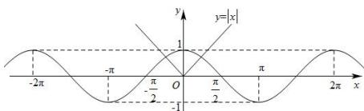
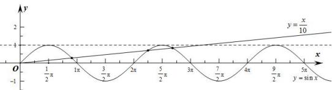

> [!faq]- 全练一本通解析
> **【解析】**
> 2;7
> 解析: 在同一坐标系中作出函数 $y = |x|$ 及函数 $y = \cos x$ 的图象, 如图所示.
> 
> 发现有 2 个交点, 所以方程 $\left|x\right|=\cos x$ 有 2 个根.
> 在同一坐标系中作出函数 $y = \sin x$ 及函数 $y = \frac{x}{10}$ 的图象, 如图所示.
> 由题意得, 当 $x=3\pi$ 时, $y=\frac{x}{10}=\frac{3\pi}{10}<1$ ; 当 $x=4\pi$ 时, $y=\frac{x}{10}=\frac{4\pi}{10}>1$ .
> 在同一坐标系内分别作出函数 $y=\sin x$ 和函数 $y=\frac{x}{10}$ 在 y 轴右侧的图象, 如图所示.
> 
> 由图象知, 直线 $y=\frac{x}{10}$ 在 y 轴右侧与函数 $y=\sin x$ 的图象有且只有 3 个公共点,
> 又由函数为奇函数的性质可知, 在 y 轴左侧两函数的图象也有 3 个公共点, 加上原点 $O(0,0)$ , 共有 7 个公共点.
> 所以方程 $\sin x=\frac{x}{10}$ 根的个数为 7.
