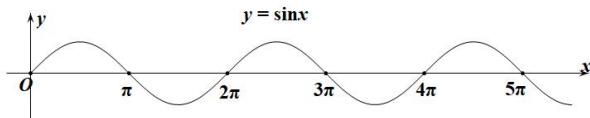

> [!faq]- 全练一本通解析
> **【答案】** $4\pi \leq a < 5\pi$
>
> **【解析】**
> $y = \sin x$ 的图像如下图所示：
> 
> 因为 $y = \sin x, x \in [0, a]$ 与 $x$ 轴有5个交点，
> 由图象可知： $4\pi \leq a < 5\pi$
> 故答案为: $4\pi \leq a < 5\pi$ .
