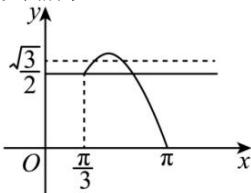

> [!faq]- 全练一本通解析
> **【答案】** $-1 < a \leq 1 - \sqrt{3}$
>
> **【解析】**
> 首先作出 $y=\sin x$ , $x\in[\frac{\pi}{3},\pi]$ 的图象, 然后再作出 $y=\frac{1-a}{2}$ 的图象, 如图所示.
> 
> 由图象可知, 当 $\frac{\sqrt{3}}{2} \leq \frac{1 - a}{2} < 1$ , 即 $-1 < a \leq 1 - \sqrt{3}$ 时, 图象有两个交点, 即方程 $\sin x = \frac{1 - a}{2}$ 在 $x \in [\frac{\pi}{3}, \pi]$ 上有两个实根.
