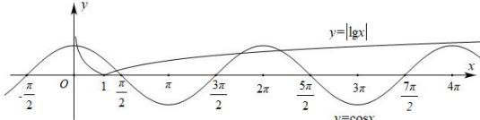

> [!faq]- 全练一本通解析
> **【答案】** A
>
> **【解析】**
> 解析:由 $f(x)=\cos x-\left|\lg x\right|=0$ , 得 $\cos x=\left|\lg x\right|$
> 所以函数 $f(x)$ 零点的个数等于 $y = \cos x, y = |\lg x|$ 图象的交点的个数，
> 函数 $y = \cos x, y = |\lg x|$ 的图象如图所示，
> 
> 由图象可知两函数图象有 4 个交点, 所以 $f(x)$ 有 4 个零点,
>
> 故选 **A**
