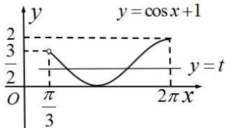

> [!faq]- 全练一本通解析
> **【答案】** 详见解析
>
> **【解析】**
> 在同一个坐标系内做出 $f(x)=1+\cos x$ , $x\in\left(\frac{\pi}{3},2\pi\right]$ 的图象与直线 y=t 的图像如图示:
> 
> 根据图像, 进行判断:
> 当 t=2 时, 有一个交点;
> 当 t=0 或 $\frac{3}{2}<t<2$ 时, 有 1 个交点;
> 当 $0 < t < \frac{3}{2}$ ，有 2 个交点，当 $t = \frac{3}{2}$ ，有 1 个交点；
> 当 $t=\frac{3}{2}$ ，有 1 个交点.
