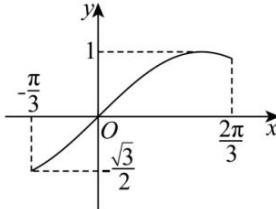

> [!faq]- 全练一本通解析
> **【解析】**
> （1） $\left[-\frac{5\pi}{6}+2k\pi,\frac{\pi}{6}+2k\pi\right], k\in Z$ ; （2） $\left[-\frac{\sqrt{3}}{2},1\right]$ .
> 解析: （1）因为 $f(x)=\sin x+\cos\left(x+\frac{\pi}{6}\right)$ $=\sin x+\frac{\sqrt{3}}{2}\cos x-\frac{1}{2}\sin x=\frac{1}{2}\sin x+\frac{\sqrt{3}}{2}\cos x=\sin(x+\frac{\pi}{3})$ 由 $-\frac{\pi}{2}+2k\pi\leq x+\frac{\pi}{3}\leq\frac{\pi}{2}+2k\pi, k\in Z$ , 得 $-\frac{5\pi}{6}+2k\pi\leq x\leq\frac{\pi}{6}+2k\pi, k\in Z$ ,
> 所以函数 $f(x)$ 单调递增区间 $\left[-\frac{5\pi}{6}+2k\pi,\frac{\pi}{6}+2k\pi\right], k\in Z$ .
> （2）由（1）可知， $g(x)=f(2x-\frac{2\pi}{3})=\sin(2x-\frac{\pi}{3})$ ，
> 因为 $x \in \left[0, \frac{\pi}{2}\right]$ ，所以 $2x - \frac{\pi}{3} \in \left[-\frac{\pi}{3}, \frac{2\pi}{3}\right]$ ，如图：
> 
> 所以 $\sin(2x-\frac{\pi}{3})\in\left[-\frac{\sqrt{3}}{2},1\right]$ 所以 $g(x)$ 在 $\left[0,\frac{\pi}{2}\right]$ 的值域为 $\left[-\frac{\sqrt{3}}{2},1\right]$ .
