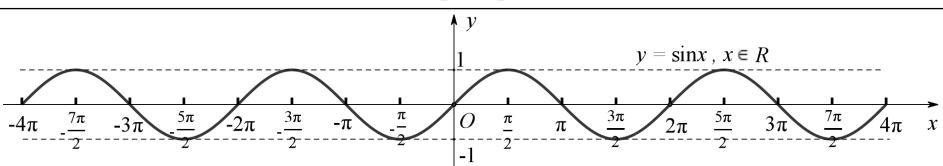
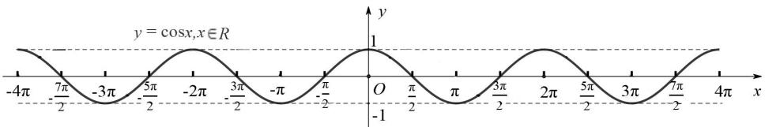

# 第六节 正余弦函数的性质

# 第六节 正余弦函数的性质

## 知识导学

## 1. 周期函数

函数 $y = f(x)$ ，定义域为 I，当 $x \in I$ 时，都有 $f(x + T) = f(x)$ ，其中 T 是一个非零的常数，则 $y = f(x)$ 是周期函数，T 是它的一个周期.

注意:对于周期函数来说,如果所有的周期中存在一个最小的正数,就称它为最小正周期,三角函数中的周期一般都指最小正周期.

## 2. 正弦函数的图像与性质

<table><tr><td>函数</td><td> $y = \sin x$ </td></tr><tr><td>定义域</td><td>R</td></tr><tr><td>值域</td><td>[-1,1]</td></tr><tr><td>图像</td><td></td></tr><tr><td>奇偶性</td><td>奇函数</td></tr><tr><td>周期性</td><td>周期:  $2k\pi (k \in \mathbf{Z}, k \neq 0)$ , 最小正周期:  $2\pi$ </td></tr><tr><td>单调性</td><td>在 $\left[-\frac{\pi}{2} + 2k\pi, \frac{\pi}{2} + 2k\pi\right](k \in \mathbf{Z})$ 上递增,从-1增大到1;在 $\left[\frac{\pi}{2} + 2k\pi, \frac{3\pi}{2} + 2k\pi\right](k \in \mathbf{Z})$ 上递减,从1减小到-1</td></tr><tr><td>最值</td><td>当 $x = \frac{\pi}{2} + 2k\pi (k \in \mathbf{Z})$ 时, $y_{\max} = 1$ ;当 $x = \frac{3\pi}{2} + 2k\pi (k \in \mathbf{Z})$ 时, $y_{\min} = -1$ </td></tr><tr><td>零点</td><td> $k\pi (k \in \mathbf{Z})$ </td></tr><tr><td>对称性</td><td>对称轴: $x = \frac{\pi}{2} + k\pi (k \in \mathbf{Z})$ ,对称中心:( $k\pi, 0$ )( $k \in \mathbf{Z}$ )</td></tr></table>

## 3. 余弦函数的图像与性质

<table><tr><td>函数</td><td> $y = \cos x$ </td></tr><tr><td>定义域</td><td>R</td></tr><tr><td>值域</td><td>[-1,1]</td></tr><tr><td>图像</td><td></td></tr><tr><td>奇偶性</td><td>偶函数</td></tr><tr><td>周期性</td><td>周期:  $2k\pi (k \in \mathbf{Z}, k \neq 0)$ , 最小正周期:  $2\pi$ </td></tr><tr><td>单调性</td><td>在 $[-\pi + 2k\pi, 2k\pi](k \in \mathbf{Z})$ 上递增, 从-1增大到1;在 $[2k\pi, \pi + 2k\pi](k \in \mathbf{Z})$ 上递减, 从1减小到-1</td></tr><tr><td>最值</td><td>当 $x = 2k\pi (k \in \mathbf{Z})$ 时, $y_{\max} = 1$ ; 当 $x = \pi + 2k\pi (k \in \mathbf{Z})$ 时, $y_{\min} = -1$ </td></tr><tr><td>零点</td><td> $\frac{\pi}{2} + k\pi (k \in \mathbf{Z})$ </td></tr><tr><td>对称性</td><td>对称轴: $x = k\pi (k \in \mathbf{Z})$ , 对称中心: $(\frac{\pi}{2} + k\pi, 0)(k \in \mathbf{Z})$ </td></tr></table>

![[高中/课堂同步/题库/高中数学全练一本通/三角函数/第六节 正余弦函数的性质/▶基础点 1_ 判断三角函数的周期/▶基础点 1_ 判断三角函数的周期.md]]
![[高中/课堂同步/题库/高中数学全练一本通/三角函数/第六节 正余弦函数的性质/▶基础点 2_ 判断三角函数的奇偶性/▶基础点 2_ 判断三角函数的奇偶性.md]]
![[高中/课堂同步/题库/高中数学全练一本通/三角函数/第六节 正余弦函数的性质/▶基础点 3_ 求三角函数的单调性/▶基础点 3_ 求三角函数的单调性.md]]
![[高中/课堂同步/题库/高中数学全练一本通/三角函数/第六节 正余弦函数的性质/▶基础点 4_ 函数的对称轴与对称中心/▶基础点 4_ 函数的对称轴与对称中心.md]]
![[高中/课堂同步/题库/高中数学全练一本通/三角函数/第六节 正余弦函数的性质/▶基础点 5_三角函数的值域问题/▶基础点 5_三角函数的值域问题.md]]
![[高中/课堂同步/题库/高中数学全练一本通/三角函数/第六节 正余弦函数的性质/题型 1_ 利用三角函数单调性比较大小/题型 1_ 利用三角函数单调性比较大小.md]]
![[高中/课堂同步/题库/高中数学全练一本通/三角函数/第六节 正余弦函数的性质/题型 2_ 已知值域求参数/题型 2_ 已知值域求参数.md]]
![[高中/课堂同步/题库/高中数学全练一本通/三角函数/第六节 正余弦函数的性质/题型 3_ 已知奇偶性求参数与值/题型 3_ 已知奇偶性求参数与值.md]]
![[高中/课堂同步/题库/高中数学全练一本通/三角函数/第六节 正余弦函数的性质/题型 4_ 周期与奇偶性综合/题型 4_ 周期与奇偶性综合.md]]
![[高中/课堂同步/题库/高中数学全练一本通/三角函数/第六节 正余弦函数的性质/题型 5_ 已知对称性求参数/题型 5_ 已知对称性求参数.md]]
![[高中/课堂同步/题库/高中数学全练一本通/三角函数/第六节 正余弦函数的性质/题型 6_ 对称性与周期性之间的关系 根据正余弦函数图像可知：/题型 6_ 对称性与周期性之间的关系 根据正余弦函数图像可知：.md]]
![[高中/课堂同步/题库/高中数学全练一本通/三角函数/第六节 正余弦函数的性质/题型 7_ 已知单调性求参数/题型 7_ 已知单调性求参数.md]]
