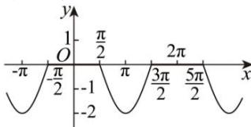
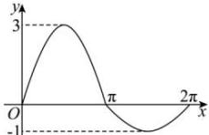

> [!faq]- 全练一本通解析
> **【解析】**
> （1）[1,3]；（2） $[-2,2]$ ；（3） $[-2,0]$ ；（4） $[-1,3]$ ；
> 解析：（1）由题意知， $\sin x\in[-1,1]$ ，得 $\left|\sin x\right|\in[0,1]$ ，所以 $1\leq2\left|\sin x\right|+1\leq3$ ，即函数 $y=2\left|\sin x\right|+1$ 的值域为 $[1,3]$ .
> （2）由题意可知， $y=\sin x+\sin\left|x\right|=\begin{cases}2\sin x,x\geq0\\0,x<0\end{cases}$ ，所以函数 $y=\sin x+\sin\left|x\right|$ 的值域为 $[-2,2]$ .
> （3）当 $\cos x \geq 0$ ，即 $x \in \left[-\frac{\pi}{2} + 2k\pi, \frac{\pi}{2} + 2k\pi\right]$ 时， $y = \cos x - |\cos x| = 0$ ；
> 当 $\cos x < 0$ 即 $x \in \left(\frac{\pi}{2} + 2k\pi, \frac{3\pi}{2} + 2k\pi\right)$ 时， $y = \cos x - |\cos x| = 2\cos x$ 部分图像如图所示：
> 
> 由此值域为 $y \in [-2,0]$ .
> $$
> \sin x \geq 0
> $$
> $$
> x \in \left[ 2 k \pi , \pi + 2 k \pi \right]
> $$
> $$
> \sin x <   0, x \in (\pi + 2 k \pi , 2 \pi + 2 k \pi)
> $$
> $$
> \left| \sin x \right| = \sin x
> $$
> 时， $\left|\sin x\right|=-\sin x,\quad y=\left\{\begin{aligned}&3\sin x,x\in\left[2k\pi,\pi+2k\pi\right]\\&\sin x,x\in\left(\pi+2k\pi,2\pi+2k\pi\right)\end{aligned}\right.$ ，一个周期内得图像如图所示：
> 
> 由此值域为 $y \in [-1,3]$ .
