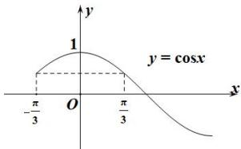

> [!faq]- 全练一本通解析
> **【答案】** $\left[0,\frac{\pi}{3}\right]$
>
> **【解析】**
> 因为值域为 $\left[\frac{1}{2},1\right]$ ，当 $x=-\frac{\pi}{3}$ 时， $y=\cos\left(-\frac{\pi}{3}\right)=\frac{1}{2}$ ，
> 由对称性可知当 $x=\frac{\pi}{3}$ 时， $y=\frac{1}{2}$ ，同时 $\cos0=1$ ，
> 由图象可知： $a\in \left[0,\frac{\pi}{3}\right]$
> 
