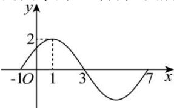
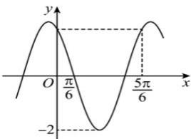

<!-- question-source:start -->
【33】（2023·全国高一专题练习）已知函数 $f(x)=A\sin(\omega x+\varphi)(A>0,\omega>0,|\varphi|<\frac{\pi}{2},x\in\mathbb{R})$ 的图象的一部分如图所示：

（1）求函数 $f(x)$ 的解析式；
（2）求函数 $f(x)$ 图象的对称轴方程.

第十一节 正弦型三角函数的图像与性质【34】（2023·山西高二统考学业考试）已知函数 $f(x) = A \sin (\omega x + \varphi) (A > 0, \omega > 0, |\varphi| < \pi)$ 的部分图像如图所示，且 $f(0) = f\left(\frac{5\pi}{6}\right)$ ， $f\left(\frac{\pi}{6}\right) = 0$ .

（1）求函数 $f(x)$ 的解析式；
(2) 若 $x \in \left[0, \frac{\pi}{2}\right]$ ，求 $f(x)$ 的最大值和最小值.
<!-- question-source:end -->

![[Q00004654A1]]
