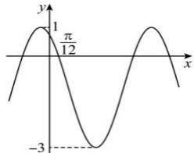

<!-- question-source:start -->
【35】（2023·全国高一专题练习）已知函数 $f(x) = A \sin (\omega x + \varphi) + b (A > 0, \omega > 0, 0 < \varphi < \pi)$ 图象相邻的两条对称轴的距离为 $\frac{\pi}{2}$ ，在一个周期内的图象如图所示.

（1）求函数 $f(x)$ 的解析式；

（2）求函数 $f(x)$ 在 $\left[\frac{\pi}{2},\frac{3\pi}{2}\right]$ 上的单调递增区间.
<!-- question-source:end -->

![[Q00004655A1]]
