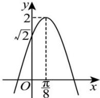

<!-- question-source:start -->
【36】（2023·青海海东高一统考）已知函数 $f(x) = A\sin (\omega x + \varphi)\left(A > 0, 0 < \omega < 3, |\varphi| < \frac{\pi}{2}\right)$ 的部分图象如图所示.

(1) 求 $f(x)$ 的解析式;

(2) 求 $f(x)$ 的单调递减区间;

（3）若不等式 $f(x) \geq m$ 在 $\left[-\frac{\pi}{24}, \frac{5\pi}{24}\right]$ 上恒成立，求 $m$ 的取值范围.
<!-- question-source:end -->

![[Q00006815A1]]
