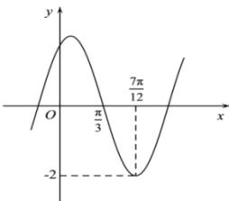

<!-- question-source:start -->
【37】（2023·重庆高三校联考练习）已知函数 $f(x) = A \sin (\omega x + \varphi) \left( A > 0, \omega > 0, |\varphi| < \frac{\pi}{2} \right)$ 的部分图象如图所示.

(1) 求 $f(x)$ 的解析式;

（2）方程 $f(x)=m$ 在 $\left[0,\frac{7\pi}{12}\right]$ 上有且仅有两个不同的实数解，求实数 m 的取值范围.

第十一节 正弦型三角函数的图像与性质
<!-- question-source:end -->

![[Q00006816A1]]
