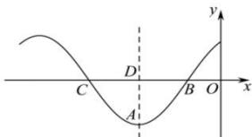

<!-- question-source:start -->
【38】（2023·全国高一专题练习）如图为函数 $f(x) = 2\cos (\omega x + \varphi)\left(\omega > 0, |\varphi| < \frac{\pi}{2}\right)$ 的部分图象，且 $|CD| = \frac{\pi}{4}$ ， $A\left(-\frac{5\pi}{12}, -2\right)$ .

(1) 求 $\omega, \varphi$ 的值;

（2）将 $f(x)$ 的图象上所有点的横坐标扩大到原来的 3 倍（纵坐标不变），再向右平移 $\frac{3\pi}{4}$ 个单位，得到函数 $g(x)$ ，讨论函数 $y = g(x) - a$ 在区间 $\left[-\pi, \frac{\pi}{2}\right]$ 的零点个数.
<!-- question-source:end -->

![[Q00006817A1]]
